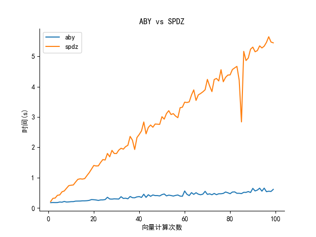

# 基于ABY框架的FATE纵向线性回归组件V0.0.1

按顺序参考以下说明即可完成此组件的使用以及测试。

### 架构图


<hr>

### 开发文档（开发日志）

1. [百万富翁测试组件嵌入](./ABY_millionare.md)
2. [ABY框架加法乘法底层算子嵌入](./ABY_add_and_mul.md)
3. [ABY框架加密安全层嵌入开发](./ABY_secureprotol.md)
4. [ABY计算框架大整数封装](./ABY_big_integer.md)
4. [纵向联邦学习组件性能比较](./ABY_hetero_federated_linear_regression.md)

<hr>

### 结果展示

#### ABY计算框架对比FATE自带的SPDZ计算框架

测试参数

| 属性     | 值   |
|--------|-----|
| 向量长度   | 7   |
| 计算最小轮次 | 1   |
| 计算最大轮次 | 100 |
| 测试步长   | 1   |

##### 时间对比


##### 速度对比


总结：100轮的计算速度相较于SDPZ计算框架提升了近10倍，并且随着计算轮次的增加，ABY计算框架的计算速度提升更加明显。

<hr>

#### 纵向线性回归 with ABY VS 纵向线性回归 with SPDZ in FATE（旧版测试记录，新版测试记录完成中，已经解决精度问题）

测试参数

| 属性         | 值      |
|------------|--------|
| 模型         | 线性回归   |
| 联邦学习模型     | 纵向线性回归 |
| 参与方数量      | 2      |
| 正则化方法      | L2     |
| 正则化权重alpha | 0.01   |
| 优化器        | sgd    |
| 学习率        | 0.15   |
| 训练轮次       | 20     |
| 数据预处理      | 归一化    |

```
FATE:
[DEBUG] [2023-11-23 18:17:58,494] [202311231816233263820] [689892:139985375817728] - [hetero_sshe_linear_model.fit_single_model] [line:468]: loss_history: [26049023.000000022, 13515914.602731092, 7030838.903021234, 3675042.0371862026, 1938355.6423245394, 1039415.6400727908, 573942.4127413348, 332760.43681411794, 207641.36676208166, 142587.1040462379, 108623.58277425249, 90759.03552061596, 81236.17950154643, 76040.88663763885, 73095.76331099572, 71325.50496645068, 70173.30836209778, 69350.66175897527, 68707.88523943364, 68167.14735449129]
[INFO] [2023-11-23 18:17:59,092] [202311231816233263820] [689892:139985375817728] - [base_worker.run] [line:157]: worker TaskExecutor, process role: ProcessRole.WORKER, pid: 689892, elapsed: 69439 ms


ABY: 
[DEBUG] [2023-11-23 18:17:30,723] [202311231816336421400] [690140:140337025019904] - [hetero_sshe_linear_model.aby_fit_single_model] [line:665]: aby_loss_history: [26049023.0, 13517830.96413953, 7034707.901364944, 3681606.285003476, 1948073.4866286449, 1052344.557023342, 589860.7932816641, 351308.3462227727, 228421.67600798619, 165223.81250461505, 132788.86802205694, 116181.10473606299, 107696.89352800207, 103368.8369166484, 101158.03911672285, 100019.79411511395, 99421.03537178892, 99091.35823381448, 98894.73520920883, 98763.54721912503]
[INFO] [2023-11-23 18:17:31,714] [202311231816336421400] [690140:140337025019904] - [base_worker.run] [line:157]: worker TaskExecutor, process role: ProcessRole.WORKER, pid: 690140, elapsed: 23924 ms
```

- FATE/SPDZ方案耗时：69439 ms

- ABY嵌入方案耗时：23924 ms

  ​

损失函数


总结：20轮的训练速度几乎是FATE自带的3倍，也就是性能提升了三倍，导致损失差异的原因是定点数的精度问题。（新的开发版本已经解决精度问题）


