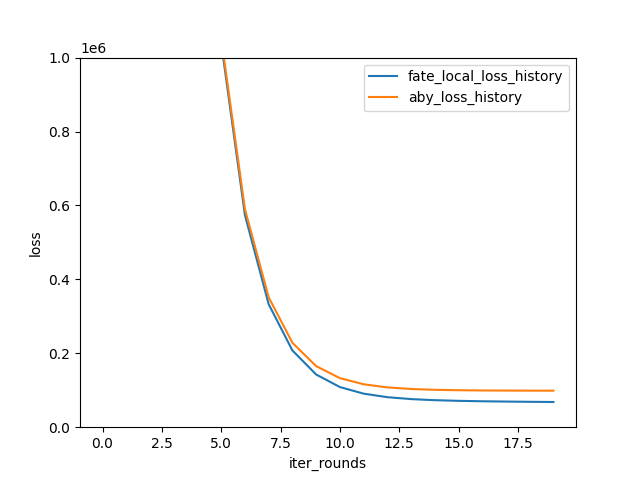

# 纵向联邦学习组件性能比较教程

承接《ABY框架加密安全层嵌入开发》

首先准备好相关环境变量

```bash
export FEDERATEDML_LIBRARY_PATH=/home/lab/federated_learning/fate/from_src_build/FATE/python/federatedml # {federatedml包路径}
export ABY_LIBRARY_PATH=/home/lab/federated_learning/fate/from_src_build/FATE/python/federatedml/ABY/CPP/extern/ABY # {ABY项目根目录}
export ABY_CPP_SRC_PATH=$FEDERATEDML_LIBRARY_PATH/ABY/CPP
export ABY_COMPONENT_PATH=$FEDERATEDML_LIBRARY_PATH/ABY
export ABY_FATE_TEST_PATH=$FATE_PROJECT_BASE/aby_fate_test
```

## 激活环境后

```BASH
cd $ABY_COMPONENT_PATH
cp  -r ../linear_model/ ./linear_model/
vim  linear_model/bilateral_linear_model/hetero_sshe_linear_model.py 
vim linear_model/bilateral_linear_model/hetero_sshe_linear_regression/hetero_linr_guest.py
vim linear_model/bilateral_linear_model/hetero_sshe_linear_regression/hetero_linr_host.py 
vim ../param/aby_hetero_sshe_linr_param.py
vim ../components/aby_hetero_sshe_linr.py
```

### linear_model/bilateral_linear_model/hetero_sshe_linear_model.py 

```PYTHON
import copy
from abc import ABC

import numpy as np

from fate_arch.session import get_parties
from federatedml.framework.hetero.procedure import batch_generator
from federatedml.ABY.linear_model.linear_model_base import ABYBaseLinearModel
from federatedml.ABY.linear_model.linear_model_weight import LinearModelWeights
from federatedml.param.init_model_param import InitParam
from federatedml.protobuf.generated import sshe_cipher_param_pb2
from federatedml.ABY.aby_secureprotol import PaillierEncrypt
from federatedml.ABY.aby_secureprotol.fate_paillier import PaillierPublicKey, PaillierPrivateKey, \
    PaillierEncryptedNumber
from federatedml.ABY.aby_secureprotol.fixedpoint import FixedPointEndec
from federatedml.ABY.aby_secureprotol.spdz import SPDZ
from federatedml.ABY.aby_secureprotol.spdz.secure_matrix.secure_matrix import SecureMatrix
from federatedml.ABY.aby_secureprotol.spdz.tensor import fixedpoint_table, fixedpoint_numpy
from federatedml.statistic.data_overview import with_weight, scale_sample_weight
from federatedml.transfer_variable.transfer_class.batch_generator_transfer_variable import \
    BatchGeneratorTransferVariable
from federatedml.transfer_variable.transfer_class.converge_checker_transfer_variable import \
    ConvergeCheckerTransferVariable
from federatedml.transfer_variable.transfer_class.sshe_model_transfer_variable import SSHEModelTransferVariable
from federatedml.util import LOGGER
from federatedml.util import consts

from federatedml.ABY.aby_secureprotol.aby_fixedpoint import ABYFixedPointEndec
from federatedml.ABY.aby_secureprotol.aby.tensor import fixedpoint_table as aby_fixedpoint_table, \
    fixedpoint_numpy as aby_fixedpoint_numpy
from federatedml.ABY.aby_secureprotol.aby import ABY


class ABYHeteroSSHEBase(ABYBaseLinearModel, ABC):
    def __init__(self):
        super().__init__()
        self.mode = consts.HETERO
        self.cipher = None
        self.q_field = None
        self.model_param = None
        # self.labels = None
        self.weight = None
        self.batch_generator = None
        self.batch_num = []
        self.secure_matrix_obj: SecureMatrix
        # self._set_parties()
        self.parties = None
        self.local_party = None
        self.other_party = None
        self.label_type = None

    def _transfer_q_field(self):
        raise NotImplementedError(f"Should not be called here")

    def _init_model(self, params):
        super()._init_model(params)
        self.cipher = PaillierEncrypt()
        self.cipher.generate_key(self.model_param.encrypt_param.key_length)
        self.transfer_variable = SSHEModelTransferVariable()

        self.converge_func_name = params.early_stop
        self.reveal_every_iter = params.reveal_every_iter

        self.q_field = self._transfer_q_field()

        LOGGER.debug(f"q_field: {self.q_field}")

        if not self.reveal_every_iter:
            self.self_optimizer = copy.deepcopy(self.optimizer)
            self.remote_optimizer = copy.deepcopy(self.optimizer)

        self.fixedpoint_encoder = FixedPointEndec(n=self.q_field)
        self.converge_transfer_variable = ConvergeCheckerTransferVariable()
        self.secure_matrix_obj = SecureMatrix(party=self.local_party,
                                              q_field=self.q_field,
                                              other_party=self.other_party)

        # ABY
        self.aby_fixedpoint_encoder = ABYFixedPointEndec()

    def _init_weights(self, model_shape):
        return self.initializer.init_model(model_shape, init_params=self.init_param_obj)

    @property
    def is_respectively_reveal(self):
        return self.model_param.reveal_strategy == "respectively"

    def _cal_z_in_share(self, w_self, w_remote, features, suffix, cipher):
        raise NotImplementedError("Should not be called here")

    def share_model(self, w, suffix):
        raise NotImplementedError("Should not be called here")

    def forward(self, weights, features, labels, suffix, cipher, batch_weight):
        raise NotImplementedError("Should not be called here")

    def aby_forward(self, weights, features, labels, suffix, cipher, batch_weight):
        raise NotImplementedError("Should not be called here")

    def backward(self, error, features, suffix, cipher):
        raise NotImplementedError("Should not be called here")

    def aby_backward(self, error, features, suffix, cipher):
        raise NotImplementedError("Should not be called here")

    def compute_loss(self, weights, labels, suffix, cipher):
        raise NotImplementedError("Should not be called here")

    def aby_compute_loss(self, weights, labels, suffix, cipher):
        raise NotImplementedError("Should not be called here")

    def reveal_models(self, w_self, w_remote, suffix=None):
        raise NotImplementedError(f"Should not be called here")

    def check_converge_by_loss(self, loss, suffix):
        raise NotImplementedError(f"Should not be called here")

    def check_converge_by_weights(self, last_w, new_w, suffix):
        if self.reveal_every_iter:
            return self._reveal_every_iter_weights_check(last_w, new_w, suffix)
        else:
            return self._not_reveal_every_iter_weights_check(last_w, new_w, suffix)

    def _reveal_every_iter_weights_check(self, last_w, new_w, suffix):
        raise NotImplementedError("Should not be called here")

    def _not_reveal_every_iter_weights_check(self, last_w, new_w, suffix):
        last_w_self, last_w_remote = last_w
        w_self, w_remote = new_w
        grad_self = w_self - last_w_self
        grad_remote = w_remote - last_w_remote

        if self.role == consts.GUEST:
            grad_encode = np.hstack((grad_remote.value, grad_self.value))
        else:
            grad_encode = np.hstack((grad_self.value, grad_remote.value))

        grad_encode = np.array([grad_encode])

        grad_tensor_name = ".".join(("check_converge_grad",) + suffix)
        grad_tensor = fixedpoint_numpy.FixedPointTensor(value=grad_encode,
                                                        q_field=self.fixedpoint_encoder.n,
                                                        endec=self.fixedpoint_encoder,
                                                        tensor_name=grad_tensor_name)

        grad_tensor_transpose_name = ".".join(("check_converge_grad_transpose",) + suffix)
        grad_tensor_transpose = fixedpoint_numpy.FixedPointTensor(value=grad_encode.T,
                                                                  q_field=self.fixedpoint_encoder.n,
                                                                  endec=self.fixedpoint_encoder,
                                                                  tensor_name=grad_tensor_transpose_name)

        grad_norm_tensor_name = ".".join(("check_converge_grad_norm",) + suffix)

        grad_norm = grad_tensor.dot(grad_tensor_transpose, target_name=grad_norm_tensor_name).get()

        weight_diff = np.sqrt(grad_norm[0][0])
        LOGGER.info("iter: {}, weight_diff:{}, is_converged: {}".format(self.n_iter_,
                                                                        weight_diff, self.is_converged))
        is_converge = False
        if weight_diff < self.model_param.tol:
            is_converge = True
        return is_converge

    def get_single_model_weight_dict(self, model_weights=None, header=None):
        header = header if header else self.header
        model_weights = model_weights if model_weights else self.model_weights
        weight_dict = {}
        for idx, header_name in enumerate(header):
            coef_i = model_weights.coef_[idx]
            weight_dict[header_name] = coef_i

        return weight_dict

    def get_single_model_param(self, model_weights=None, header=None):
        header = header if header else self.header
        result = {'iters': self.n_iter_,
                  'loss_history': self.loss_history,
                  'is_converged': self.is_converged,
                  'intercept': self.model_weights.intercept_,
                  'header': header,
                  'best_iteration': -1 if self.validation_strategy is None else
                  self.validation_strategy.best_iteration
                  }
        return result

    def load_model(self, model_dict):
        LOGGER.debug("Start Loading model")
        result_obj = list(model_dict.get('model').values())[0].get(self.model_param_name)
        meta_obj = list(model_dict.get('model').values())[0].get(self.model_meta_name)

        if self.init_param_obj is None:
            self.init_param_obj = InitParam()
        self.init_param_obj.fit_intercept = meta_obj.fit_intercept
        self.model_param.reveal_strategy = meta_obj.reveal_strategy
        LOGGER.debug(f"reveal_strategy: {self.model_param.reveal_strategy}, {self.is_respectively_reveal}")
        self.header = list(result_obj.header)
        return result_obj, meta_obj

    def load_single_model(self, single_model_obj):
        raise NotImplementedError(f"should not be called here")

    def load_single_model_weight(self, single_model_obj):
        feature_shape = len(self.header)
        tmp_vars = np.zeros(feature_shape)
        weight_dict = dict(single_model_obj.weight)

        for idx, header_name in enumerate(self.header):
            tmp_vars[idx] = weight_dict.get(header_name)

        if self.fit_intercept:
            tmp_vars = np.append(tmp_vars, single_model_obj.intercept)
        self.model_weights = LinearModelWeights(tmp_vars, fit_intercept=self.fit_intercept)

    def fit_single_model(self, data_instances, validate_data=None):
        LOGGER.info(f"Start to train single {self.model_name}")
        if len(self.component_properties.host_party_idlist) > 1:
            raise ValueError(f"Hetero SSHE Model does not support multi-host training.")  # 目前只支持两方
        # 输出self.component_properties，包括该对象的所有属性
        LOGGER.debug(f"XXXXXXXXXXXXXXXXXXXXXXXXXXXXXXXXXXXXXXXXXXXXXXXX")
        LOGGER.debug(f"self.component_properties: {self.component_properties}")
        for property_name in self.component_properties.__dict__:
            LOGGER.debug(
                f"self.component_properties.{property_name}: {self.component_properties.__dict__[property_name]}")

        self.callback_list.on_train_begin(data_instances, validate_data)
        LOGGER.debug(f"XXXXXXXXXXXXXXXXXXXXXXXXXXXXXXXXXXXXXXXXXXXXXXXX")
        LOGGER.debug(f"self.callback_list: {self.callback_list}")
        for callback in self.callback_list.__dict__:
            LOGGER.debug(f"self.callback_list.{callback}: {self.callback_list.__dict__[callback]}")

        model_shape = self.get_features_shape(data_instances)
        LOGGER.debug(f"model_shape: {model_shape}")
        instances_count = data_instances.count()
        LOGGER.debug(f"instances_count: {instances_count}")

        if not self.component_properties.is_warm_start:
            w = self._init_weights(model_shape)
            LOGGER.debug(f"w: {w}")
            self.model_weights = LinearModelWeights(l=w,
                                                    fit_intercept=self.model_param.init_param.fit_intercept,
                                                    raise_overflow_error=False)
            LOGGER.debug(f"self.model_weights: {self.model_weights}")

            last_models = copy.deepcopy(self.model_weights)
        else:
            last_models = copy.deepcopy(self.model_weights)
            w = last_models.unboxed
            self.callback_warm_start_init_iter(self.n_iter_)

        if self.role == consts.GUEST:
            if with_weight(data_instances):
                LOGGER.info(f"data with sample weight, use sample weight.")
                if self.model_param.early_stop == "diff":
                    LOGGER.warning("input data with weight, please use 'weight_diff' for 'early_stop'.")
                data_instances = scale_sample_weight(data_instances)
        self.batch_generator.initialize_batch_generator(data_instances, batch_size=self.batch_size)

        with SPDZ(
                "hetero_sshe",
                local_party=self.local_party,
                all_parties=self.parties,
                q_field=self.q_field,
                use_mix_rand=self.model_param.use_mix_rand,
        ) as spdz:
            with ABY(
                    "aby_hetero_sshe",
                    local_party=self.local_party,
                    all_parties=self.parties,
                    q_field=self.q_field,
                    use_mix_rand=self.model_param.use_mix_rand,
            ) as aby:
                spdz.set_flowid(self.flowid)
                aby.set_flowid(self.flowid)
                self.secure_matrix_obj.set_flowid(self.flowid)
                # not sharing the model when reveal_every_iter
                if not self.reveal_every_iter:
                    w_self, w_remote = self.share_model(w, suffix="init")
                    last_w_self, last_w_remote = w_self, w_remote
                    LOGGER.debug(f"first_w_self shape: {w_self.shape}, w_remote_shape: {w_remote.shape}")
                batch_data_generator = self.batch_generator.generate_batch_data()

                encoded_batch_data = []
                batch_labels_list = []
                batch_weight_list = []

                aby_encoded_batch_data = []
                aby_batch_labels_list = []

                for batch_data in batch_data_generator:
                    if self.fit_intercept:
                        batch_features = batch_data.mapValues(lambda x: np.hstack((x.features, 1.0)))  # 带上截距
                    else:
                        batch_features = batch_data.mapValues(lambda x: x.features)
                    if self.role == consts.GUEST:
                        batch_labels = batch_data.mapValues(lambda x: np.array([x.label], dtype=self.label_type))
                        batch_labels_list.append(batch_labels)

                        batch_labels_numpy = np.array([i[1] for i in batch_labels.collect()])

                        aby_batch_labels_list.append(batch_labels_numpy)
                        LOGGER.debug(f"batch_labels_numpy: {batch_labels_numpy}")

                        if self.weight:
                            batch_weight = batch_data.mapValues(lambda x: np.array([x.weight], dtype=float))
                            batch_weight_list.append(batch_weight)
                        else:
                            batch_weight_list.append(None)

                    self.batch_num.append(batch_data.count())

                    encoded_batch_data.append(
                        fixedpoint_table.FixedPointTensor(self.fixedpoint_encoder.encode(batch_features),
                                                          q_field=self.fixedpoint_encoder.n,
                                                          endec=self.fixedpoint_encoder))

                    batch_features_numpy = np.array([i[1] for i in batch_features.collect()])
                    LOGGER.debug(f"batch_features_numpy: {batch_features_numpy}")

                    # TODO: ABY
                    aby_encoded_batch_data.append(
                        aby_fixedpoint_numpy.ABYFixedPointTensor(
                            self.aby_fixedpoint_encoder.encode(batch_features_numpy),
                            endec=self.aby_fixedpoint_encoder))

                LOGGER.debug(f"encoded_batch_data: {encoded_batch_data}")
                LOGGER.debug(f"batch_labels_list: {batch_labels_list}")
                LOGGER.debug(f"batch_weight_list: {batch_weight_list}")

                LOGGER.debug(f"aby_encoded_batch_data: {aby_encoded_batch_data}")
                LOGGER.debug(f"aby_batch_labels_list: {aby_batch_labels_list}")

                while self.n_iter_ < self.max_iter:
                    self.callback_list.on_epoch_begin(self.n_iter_)
                    LOGGER.info(f"start to n_iter: {self.n_iter_}")

                    loss_list = []

                    aby_loss_list = []

                    self.optimizer.set_iters(self.n_iter_)
                    if not self.reveal_every_iter:
                        self.self_optimizer.set_iters(self.n_iter_)
                        self.remote_optimizer.set_iters(self.n_iter_)

                    for batch_idx, batch_data in enumerate(encoded_batch_data):
                        aby_batch_data = aby_encoded_batch_data[batch_idx]

                        LOGGER.info(f"batch_idx: {batch_idx}")
                        LOGGER.info(f"batch_data: {batch_data}")
                        LOGGER.info(
                            f"aby_batch_data: {aby_batch_data} type(aby_batch_data): {type(aby_batch_data)} aby_batch_data.shape: {aby_batch_data.shape}")

                        current_suffix = (str(self.n_iter_), str(batch_idx))
                        if self.role == consts.GUEST:
                            batch_labels = batch_labels_list[batch_idx]
                            batch_weight = batch_weight_list[batch_idx]
                            aby_batch_labels = aby_batch_labels_list[batch_idx]

                        else:
                            batch_labels = None
                            batch_weight = None
                            aby_batch_labels = None

                        LOGGER.debug(f"batch_labels: {batch_labels}")
                        LOGGER.debug(f"batch_weight: {batch_weight}")
                        LOGGER.debug(f"aby_batch_labels: {aby_batch_labels}")

                        if self.reveal_every_iter:
                            aby_y = self.aby_forward(weights=self.model_weights,
                                                     features=aby_batch_data,
                                                     labels=aby_batch_labels,
                                                     suffix=current_suffix,
                                                     cipher=self.cipher,
                                                     batch_weight=batch_weight)

                            y = self.forward(weights=self.model_weights,
                                             features=batch_data,  # batch_data  是一个FixedPointTensor对象
                                             labels=batch_labels,
                                             suffix=current_suffix,
                                             cipher=self.cipher,
                                             batch_weight=batch_weight)
                        else:
                            y = self.forward(weights=(w_self, w_remote),
                                             features=batch_data,
                                             labels=batch_labels,
                                             suffix=current_suffix,
                                             cipher=self.cipher,
                                             batch_weight=batch_weight)

                        LOGGER.debug(f"y: {y}")

                        LOGGER.debug(f"aby_y: {aby_y} type(aby_y): {type(aby_y)} aby_y.shape: {aby_y.shape}")
                        # LOGGER.debug(f"y.value.first: {y.value.first()}")
                        # yvf = y.value.first()[1]
                        # LOGGER.debug(f"yvf: {yvf}")
                        # LOGGER.debug(f"yvfff: {[i.decode() for i in yvf]}")

                        if self.role == consts.GUEST:
                            if self.weight:
                                error = y - batch_labels.join(batch_weight, lambda y, b: y * b)
                            else:
                                error = y - batch_labels
                                aby_error = aby_y - aby_batch_labels

                            self_aby_g = self.aby_backward(error=aby_error,
                                                           features=aby_batch_data,
                                                           suffix=current_suffix,
                                                           cipher=self.cipher)

                            self_g, remote_g = self.backward(error=error,
                                                             features=batch_data,
                                                             suffix=current_suffix,
                                                             cipher=self.cipher)
                        else:
                            self_aby_g = self.aby_backward(error=aby_y,
                                                           features=aby_batch_data,
                                                           suffix=current_suffix,
                                                           cipher=self.cipher)

                            self_g, remote_g = self.backward(error=y,
                                                             features=batch_data,
                                                             suffix=current_suffix,
                                                             cipher=self.cipher)

                        LOGGER.debug(f"self_g: {self_g}, remote_g: {remote_g}")

                        # loss computing;
                        suffix = ("loss",) + current_suffix
                        if self.reveal_every_iter:

                            aby_batch_loss: int = self.aby_compute_loss(weights=self.model_weights,
                                                                        labels=aby_batch_labels, suffix=suffix,
                                                                        cipher=self.cipher)

                            batch_loss = self.compute_loss(weights=self.model_weights,
                                                           labels=batch_labels,
                                                           suffix=suffix,
                                                           cipher=self.cipher)
                        else:
                            batch_loss = self.compute_loss(weights=(w_self, w_remote),
                                                           labels=batch_labels,
                                                           suffix=suffix,
                                                           cipher=self.cipher)

                        LOGGER.debug(f"batch_loss: {batch_loss}")

                        LOGGER.debug(f"aby_batch_loss: {aby_batch_loss}")

                        if batch_loss is not None:
                            batch_loss = batch_loss * self.batch_num[batch_idx]
                        loss_list.append(batch_loss)

                        if aby_batch_loss is not None:
                            aby_batch_loss = aby_batch_loss * self.batch_num[batch_idx]
                        aby_loss_list.append(aby_batch_loss)

                        if self.reveal_every_iter:
                            # LOGGER.debug(f"before reveal: self_g shape: {self_g.shape}, remote_g_shape: {remote_g}，"
                            #              f"self_g: {self_g}")

                            new_g = self.reveal_models(self_g, remote_g, suffix=current_suffix)

                            # LOGGER.debug(f"after reveal: new_g shape: {new_g.shape}, new_g: {new_g}"
                            #              f"self.model_param.reveal_strategy: {self.model_param.reveal_strategy}")

                            LOGGER.debug(f"new_g: {new_g}")

                            if new_g is not None:
                                self.model_weights = self.optimizer.update_model(self.model_weights, new_g,
                                                                                 has_applied=False)

                            else:
                                self.model_weights = LinearModelWeights(
                                    l=np.zeros(self_g.shape),
                                    fit_intercept=self.model_param.init_param.fit_intercept)

                            LOGGER.debug(f"self.model_weights: {self.model_weights}")
                        else:
                            if self.optimizer.penalty == consts.L2_PENALTY:
                                self_g = self_g + self.self_optimizer.alpha * w_self
                                remote_g = remote_g + self.remote_optimizer.alpha * w_remote

                            # LOGGER.debug(f"before optimizer: {self_g}, {remote_g}")

                            self_g = self.self_optimizer.apply_gradients(self_g)
                            remote_g = self.remote_optimizer.apply_gradients(remote_g)

                            # LOGGER.debug(f"after optimizer: {self_g}, {remote_g}")
                            w_self -= self_g
                            w_remote -= remote_g

                            LOGGER.debug(f"w_self shape: {w_self.shape}, w_remote_shape: {w_remote.shape}")

                    if self.role == consts.GUEST:
                        loss = np.sum(loss_list) / instances_count
                        self.loss_history.append(loss)
                        if self.need_call_back_loss:
                            self.callback_loss(self.n_iter_, loss)
                    else:
                        loss = None

                    if self.converge_func_name in ["diff", "abs"]:
                        self.is_converged = self.check_converge_by_loss(loss, suffix=(str(self.n_iter_),))
                    elif self.converge_func_name == "weight_diff":
                        if self.reveal_every_iter:
                            self.is_converged = self.check_converge_by_weights(
                                last_w=last_models.unboxed,
                                new_w=self.model_weights.unboxed,
                                suffix=(str(self.n_iter_),))
                            last_models = copy.deepcopy(self.model_weights)
                        else:
                            self.is_converged = self.check_converge_by_weights(
                                last_w=(last_w_self, last_w_remote),
                                new_w=(w_self, w_remote),
                                suffix=(str(self.n_iter_),))
                            last_w_self, last_w_remote = copy.deepcopy(w_self), copy.deepcopy(w_remote)
                    else:
                        raise ValueError(f"Cannot recognize early_stop function: {self.converge_func_name}")

                    LOGGER.info("iter: {},  is_converged: {}".format(self.n_iter_, self.is_converged))
                    self.callback_list.on_epoch_end(self.n_iter_)
                    self.n_iter_ += 1

                    if self.stop_training:
                        break

                    if self.is_converged:
                        break

            # Finally reconstruct
            if not self.reveal_every_iter:
                new_w = self.reveal_models(w_self, w_remote, suffix=("final",))
                if new_w is not None:
                    self.model_weights = LinearModelWeights(
                        l=new_w,
                        fit_intercept=self.model_param.init_param.fit_intercept)

        LOGGER.debug(f"loss_history: {self.loss_history}")
        self.set_summary(self.get_model_summary())

    def aby_fit_single_model(self, data_instances, validate_data=None):
        LOGGER.info(f"Start to train single {self.model_name}")

        model_shape = self.get_features_shape(data_instances)
        LOGGER.debug(f"model_shape: {model_shape}")

        w = self._init_weights(model_shape)
        w = w.reshape((-1, 1))
        LOGGER.debug(f"w: {w} type(w): {type(w)} w.shape: {w.shape}")

        data_instances_numpy = np.array([i[1] for i in data_instances.collect()])
        features_numpy = np.array([i.features for i in data_instances_numpy])
        if self.role == consts.GUEST:
            features_numpy = np.hstack((features_numpy, np.ones((features_numpy.shape[0], 1))))

            labels_numpy = np.array([i.label for i in data_instances_numpy]).reshape((-1, 1))
        else:
            labels_numpy = None

        LOGGER.debug(f"data_instances_numpy: {data_instances_numpy}")
        LOGGER.debug(f"features_numpy: {features_numpy}")
        LOGGER.debug(f"labels_numpy: {labels_numpy}")

        aby_encoded_batch_data = [features_numpy]
        aby_batch_labels_list = [labels_numpy]

        while self.n_iter_ < self.max_iter:
            LOGGER.info(f"start to n_iter: {self.n_iter_}")

            LOGGER.debug(f"w: {w} type(w): {type(w)} w.shape: {w.shape}")

            self.optimizer.set_iters(self.n_iter_)
            aby_loss_list = []

            for aby_batch_idx, aby_batch_data in enumerate(aby_encoded_batch_data):
                LOGGER.info(
                    f"aby_batch_data: {aby_batch_data} type(aby_batch_data): {type(aby_batch_data)} aby_batch_data.shape: {aby_batch_data.shape}")

                if self.role == consts.GUEST:
                    aby_batch_labels = aby_batch_labels_list[aby_batch_idx]

                else:
                    aby_batch_labels = None

                LOGGER.debug(f"aby_batch_labels: {aby_batch_labels}")

                self.learning_rate = self.optimizer.decay_learning_rate()
                LOGGER.debug(f"self.learning_rate: {self.learning_rate}")
                z = aby_batch_data.dot(w)
                LOGGER.debug(f"z: {z}")
                if self.role == consts.HOST:
                    z_host = z

                    # send z_host to guest
                    aby_fixedpoint_numpy.ABYFixedPointTensor(
                        self.aby_fixedpoint_encoder.encode(z_host),
                        endec=self.aby_fixedpoint_encoder
                    ).share_add("client")

                    # receive error from guest
                    error = aby_fixedpoint_numpy.ABYFixedPointTensor(
                        self.aby_fixedpoint_encoder.encode(np.zeros(z_host.shape)),
                        endec=self.aby_fixedpoint_encoder).share_add("client").get()

                    # calculate g_host
                    # todo 有问题
                    g_host = (aby_batch_data.T.dot(error) * (1 / error.shape[0]))
                    g_host_without_intercept = g_host[:-1]
                    g_host_without_intercept = g_host_without_intercept + self.alpha * w[:-1]
                    g_host = np.vstack((g_host_without_intercept, g_host[-1]))

                    # update w
                    w = w - self.learning_rate * g_host
                elif self.role == consts.GUEST:

                    z_guest = z
                    # receive z_host from host
                    z_host = aby_fixedpoint_numpy.ABYFixedPointTensor(
                        self.aby_fixedpoint_encoder.encode(np.zeros(z_guest.shape)),
                        endec=self.aby_fixedpoint_encoder).share_add("server")
                    z_host = z_host.get()
                    z_total = z_guest + z_host
                    LOGGER.debug(f"z_total: {z_total} type(z_total): {type(z_total)} z_total.shape: {z_total.shape}")

                    error = z_total - aby_batch_labels
                    LOGGER.debug(f"error: {error} type(error): {type(error)} error.shape: {error.shape}")
                    # send error to host
                    aby_fixedpoint_numpy.ABYFixedPointTensor(
                        self.aby_fixedpoint_encoder.encode(error),
                        endec=self.aby_fixedpoint_encoder
                    ).share_add("server")

                    loss = (1 / (2 * error.shape[0])) * np.sum(error ** 2)
                    # l2 penalty
                    loss += 0.5 * self.alpha * np.sum(w ** 2)

                    LOGGER.debug(f"loss: {loss} type(loss): {type(loss)}")
                    aby_loss_list.append(loss)

                    # calculate g_guest
                    g_guest = (aby_batch_data.T.dot(error) * (1 / error.shape[0]))

                    LOGGER.debug(f"g_guest: {g_guest} type(g_guest): {type(g_guest)} g_guest.shape: {g_guest.shape}")

                    g_guest_without_intercept = g_guest[:-1]
                    g_guest_without_intercept = g_guest_without_intercept + self.alpha * w[:-1]
                    g_guest = np.vstack((g_guest_without_intercept, g_guest[-1]))

                    LOGGER.debug(f"g_guest: {g_guest} type(g_guest): {type(g_guest)} g_guest.shape: {g_guest.shape}")
                    # update w
                    w = w - self.learning_rate * g_guest

            if self.role == consts.GUEST:
                loss = np.sum(aby_loss_list) / len(aby_loss_list)
                self.aby_loss_history.append(loss)
            else:
                loss = None

            self.n_iter_ += 1

        self.model_weights = LinearModelWeights(
            l=w.reshape((-1,)),
            fit_intercept=True if self.role == consts.GUEST else False)

        LOGGER.debug(f"aby_loss_history: {self.aby_loss_history}")
        self.loss_history = self.aby_loss_history
        self.set_summary(self.get_model_summary())

    def get_model_summary(self):
        summary = super().get_model_summary()

        if not self.is_respectively_reveal:
            del summary["intercept"]
            del summary["coef"]

        return summary


class ABYHeteroSSHEGuestBase(ABYHeteroSSHEBase, ABC):
    def __init__(self):
        super().__init__()
        self.role = consts.GUEST
        self.local_party = get_parties().local_party
        self.other_party = get_parties().roles_to_parties(["host"])[0]
        self.parties = [self.local_party] + [self.other_party]
        self.encrypted_error = None
        self.encrypted_wx = None

        self.aby_encrypted_error = None

        self.z_square = None
        self.wx_self = None
        self.wx_remote = None

    def _init_model(self, params):
        super()._init_model(params)
        # self.batch_generator = batch_generator.Guest()
        # self.batch_generator.register_batch_generator(BatchGeneratorTransferVariable(), has_arbiter=False)

    def _transfer_q_field(self):
        q_field = self.cipher.public_key.n
        self.transfer_variable.q_field.remote(q_field, role=consts.HOST, suffix=("q_field",))

        return q_field

    def _cal_z(self, weights, features, suffix, cipher):
        if not self.reveal_every_iter:
            LOGGER.info(f"[forward]: Calculate z in share...")
            w_self, w_remote = weights
            z = self._cal_z_in_share(w_self, w_remote, features, suffix, cipher)
        else:
            LOGGER.info(f"[forward]: Calculate z directly...")
            w = weights.unboxed  # unboxed 直接返回numpy数组
            LOGGER.debug(f"features: {features}")
            LOGGER.debug(f"features.value: {features.value}")
            LOGGER.debug(f"features.value.first: {features.value.first()}")
            LOGGER.debug(f"features.value.first() type: {type(features.value.first())}")
            fvf = features.value.first()[1]
            LOGGER.debug(f"fvf: {fvf}")
            LOGGER.debug(f"fvffff: {[i.decode() for i in fvf]}")

            LOGGER.debug(f"w: {w}")

            z = features.dot_local(w)  # z = features * w = x * w

        remote_z = self.secure_matrix_obj.share_encrypted_matrix(suffix=suffix,
                                                                 is_remote=False,
                                                                 cipher=None,
                                                                 z=None)[0]

        self.wx_self = z
        self.wx_remote = remote_z

    def _cal_z_in_share(self, w_self, w_remote, features, suffix, cipher):
        z1 = features.dot_local(w_self)

        za_suffix = ("za",) + suffix

        za_share = self.secure_matrix_obj.secure_matrix_mul(w_remote,
                                                            tensor_name=".".join(za_suffix),
                                                            cipher=cipher,
                                                            suffix=za_suffix)
        zb_suffix = ("zb",) + suffix
        zb_share = self.secure_matrix_obj.secure_matrix_mul(features,
                                                            tensor_name=".".join(zb_suffix),
                                                            cipher=None,
                                                            suffix=zb_suffix)

        z = z1 + za_share + zb_share
        return z

    def aby_backward(self, error, features, suffix, cipher):
        LOGGER.info(f"[aby_backward]: Calculate gradient...")
        LOGGER.debug(F"error: {error} type(error): {type(error)} error.shape: {error.shape}")

        # error_guest = w_host * x_host + w_guest * x_guest - y
        batch_num = self.batch_num[int(suffix[1])]  # get the size of current batch
        error_1_n = error * (1 / batch_num)  # error_1_n = error_guest / batch_num

        LOGGER.debug(f"error_1_n: {error_1_n} type(error_1_n): {type(error_1_n)} error_1_n.shape: {error_1_n.shape}")

        error_1_n.share_mul("server", times=2)

        g = features.T.dot_local(error_1_n)  # g = x * error_1_n

        LOGGER.debug(f"g: {g} type(g): {type(g)} g.shape: {g.shape}")

        return g
        ...

    def backward(self, error, features, suffix, cipher):
        LOGGER.info(f"[backward]: Calculate gradient...")
        LOGGER.debug(F"error: {error} type: {type(error)}")
        # error_real = error.get()

        # error_guest = w_host * x_host + w_guest * x_guest - y
        batch_num = self.batch_num[int(suffix[1])]  # get the size of current batch
        error_1_n = error * (1 / batch_num)  # error_1_n = error_guest / batch_num

        ga2_suffix = ("ga2",) + suffix
        ga2_2 = self.secure_matrix_obj.secure_matrix_mul(error_1_n,
                                                         tensor_name=".".join(ga2_suffix),
                                                         cipher=cipher,
                                                         suffix=ga2_suffix,
                                                         is_fixedpoint_table=False)

        # LOGGER.debug(f"ga2_2: {ga2_2}")

        encrypt_g = self.encrypted_error.dot(features) * (
                1 / batch_num)  # encrypt_g = (w * x - y) * x / batch_num = error * x / batch_num

        # LOGGER.debug(f"encrypt_g: {encrypt_g}")

        tensor_name = ".".join(("encrypt_g",) + suffix)
        gb2 = SecureMatrix.from_source(tensor_name,
                                       encrypt_g,
                                       self.cipher,
                                       self.fixedpoint_encoder.n,
                                       self.fixedpoint_encoder)

        # LOGGER.debug(f"gb2: {gb2}")

        return gb2, ga2_2

    def share_model(self, w, suffix):
        source = [w, self.other_party]
        wb, wa = (
            fixedpoint_numpy.FixedPointTensor.from_source(f"wb_{suffix}", source[0],
                                                          encoder=self.fixedpoint_encoder,
                                                          q_field=self.q_field),
            fixedpoint_numpy.FixedPointTensor.from_source(f"wa_{suffix}", source[1],
                                                          encoder=self.fixedpoint_encoder,
                                                          q_field=self.q_field),
        )
        return wb, wa

    def reveal_models(self, w_self, w_remote, suffix=None):
        if suffix is None:
            suffix = self.n_iter_

        if self.model_param.reveal_strategy == "respectively":

            new_w = w_self.get(tensor_name=f"wb_{suffix}",
                               broadcast=False)
            w_remote.broadcast_reconstruct_share(tensor_name=f"wa_{suffix}")

        elif self.model_param.reveal_strategy == "encrypted_reveal_in_host":

            new_w = w_self.get(tensor_name=f"wb_{suffix}",
                               broadcast=False)
            encrypted_w_remote = self.cipher.recursive_encrypt(self.fixedpoint_encoder.decode(w_remote.value))
            encrypted_w_remote_tensor = fixedpoint_numpy.PaillierFixedPointTensor(value=encrypted_w_remote)
            encrypted_w_remote_tensor.broadcast_reconstruct_share(tensor_name=f"wa_{suffix}")

        else:
            raise NotImplementedError(f"reveal strategy: {self.model_param.reveal_strategy} has not been implemented.")
        return new_w

    def _reveal_every_iter_weights_check(self, last_w, new_w, suffix):
        square_sum = np.sum((last_w - new_w) ** 2)
        host_sums = self.converge_transfer_variable.square_sum.get(suffix=suffix)
        for hs in host_sums:
            square_sum += hs
        weight_diff = np.sqrt(square_sum)
        is_converge = False
        if weight_diff < self.model_param.tol:
            is_converge = True
        LOGGER.info(f"n_iter: {self.n_iter_}, weight_diff: {weight_diff}")
        self.converge_transfer_variable.converge_info.remote(is_converge, role=consts.HOST, suffix=suffix)
        return is_converge

    def check_converge_by_loss(self, loss, suffix):
        self.is_converged = self.converge_func.is_converge(loss)
        self.transfer_variable.is_converged.remote(self.is_converged, suffix=suffix)

        return self.is_converged

    def prepare_fit(self, data_instances, validate_data):
        # self.transfer_variable = SSHEModelTransferVariable()
        self.batch_generator = batch_generator.Guest()
        self.batch_generator.register_batch_generator(BatchGeneratorTransferVariable(), has_arbiter=False)
        self.header = copy.deepcopy(data_instances.schema.get("header", []))
        self._abnormal_detection(data_instances)
        self.check_abnormal_values(data_instances)
        self.check_abnormal_values(validate_data)

    def get_single_model_param(self, model_weights=None, header=None):
        result = super().get_single_model_param(model_weights, header)
        result['weight'] = self.get_single_model_weight_dict(model_weights, header)
        if not self.is_respectively_reveal:
            result["cipher"] = dict(public_key=dict(n=str(self.cipher.public_key.n)),
                                    private_key=dict(p=str(self.cipher.privacy_key.p),
                                                     q=str(self.cipher.privacy_key.q)))

        return result

    def load_single_model(self, single_model_obj):
        LOGGER.info("start to load single model")

        self.load_single_model_weight(single_model_obj)
        self.n_iter_ = single_model_obj.iters

        if not self.is_respectively_reveal:
            cipher_info = single_model_obj.cipher
            self.cipher = PaillierEncrypt()
            public_key = PaillierPublicKey(int(cipher_info.public_key.n))
            privacy_key = PaillierPrivateKey(public_key, int(cipher_info.private_key.p), int(cipher_info.private_key.q))
            self.cipher.set_public_key(public_key=public_key)
            self.cipher.set_privacy_key(privacy_key=privacy_key)

        return self


class ABYHeteroSSHEHostBase(ABYHeteroSSHEBase, ABC):
    def __init__(self):
        super().__init__()
        self.role = consts.HOST
        self.local_party = get_parties().local_party
        self.other_party = get_parties().roles_to_parties(["guest"])[0]
        self.parties = [self.other_party] + [self.local_party]
        self.wx_self = None

    def _init_model(self, params):
        super()._init_model(params)
        self.init_param_obj.fit_intercept = False
        # self.batch_generator = batch_generator.Host()
        # self.batch_generator.register_batch_generator(BatchGeneratorTransferVariable(), has_arbiter=False)

    def _transfer_q_field(self):
        q_field = self.transfer_variable.q_field.get(role=consts.GUEST, idx=0,
                                                     suffix=("q_field",))

        return q_field

    def _cal_z_in_share(self, w_self, w_remote, features, suffix, cipher):
        z1 = features.dot_local(w_self)

        za_suffix = ("za",) + suffix
        za_share = self.secure_matrix_obj.secure_matrix_mul(features,
                                                            tensor_name=".".join(za_suffix),
                                                            cipher=None,
                                                            suffix=za_suffix)

        zb_suffix = ("zb",) + suffix
        zb_share = self.secure_matrix_obj.secure_matrix_mul(w_remote,
                                                            tensor_name=".".join(zb_suffix),
                                                            cipher=cipher,
                                                            suffix=zb_suffix)

        z = z1 + za_share + zb_share
        return z

    def aby_backward(self, error, features, suffix, cipher):
        LOGGER.info(f"[aby_backward]: Calculate gradient...")
        LOGGER.debug(F"error: {error} type(error): {type(error)} error.shape: {error.shape}")

        LOGGER.debug(f"features: {features} type(features): {type(features)} features.shape: {features.shape}")

        g = features.share_mul("client")
        LOGGER.debug(f"g: {g} type(g): {type(g)} g.shape: {g.shape}")

        return g
        ...

    def backward(self, error: fixedpoint_table.FixedPointTensor, features, suffix, cipher):
        LOGGER.info(f"[backward]: Calculate gradient...")
        batch_num = self.batch_num[int(suffix[1])]
        # error_host = w_host * x_host + w_guest * x_guest

        ga = features.dot_local(error)
        # LOGGER.debug(f"ga: {ga}, batch_num: {batch_num}")
        ga = ga * (1 / batch_num)  # ga = g_host = error_host * x_host / batch_num

        zb_suffix = ("ga2",) + suffix
        ga2_1 = self.secure_matrix_obj.secure_matrix_mul(features,
                                                         tensor_name=".".join(zb_suffix),
                                                         cipher=None,
                                                         suffix=zb_suffix)

        # LOGGER.debug(f"ga2_1: {ga2_1}")

        ga_new = ga + ga2_1

        tensor_name = ".".join(("encrypt_g",) + suffix)
        gb1 = SecureMatrix.from_source(tensor_name,
                                       self.other_party,
                                       cipher,
                                       self.fixedpoint_encoder.n,
                                       self.fixedpoint_encoder,
                                       is_fixedpoint_table=False)

        # LOGGER.debug(f"gb1: {gb1}")

        return ga_new, gb1

    def share_model(self, w, suffix):
        source = [w, self.other_party]
        wa, wb = (
            fixedpoint_numpy.FixedPointTensor.from_source(f"wa_{suffix}", source[0],
                                                          encoder=self.fixedpoint_encoder,
                                                          q_field=self.q_field),
            fixedpoint_numpy.FixedPointTensor.from_source(f"wb_{suffix}", source[1],
                                                          encoder=self.fixedpoint_encoder,
                                                          q_field=self.q_field),
        )
        return wa, wb

    def reveal_models(self, w_self, w_remote, suffix=None):
        if suffix is None:
            suffix = self.n_iter_

        if self.model_param.reveal_strategy == "respectively":
            w_remote.broadcast_reconstruct_share(tensor_name=f"wb_{suffix}")
            new_w = w_self.get(tensor_name=f"wa_{suffix}",
                               broadcast=False)

        elif self.model_param.reveal_strategy == "encrypted_reveal_in_host":
            w_remote.broadcast_reconstruct_share(tensor_name=f"wb_{suffix}")
            new_w = w_self.reconstruct(tensor_name=f"wa_{suffix}", broadcast=False)

        else:
            raise NotImplementedError(f"reveal strategy: {self.model_param.reveal_strategy} has not been implemented.")
        return new_w

    def _reveal_every_iter_weights_check(self, last_w, new_w, suffix):
        square_sum = np.sum((last_w - new_w) ** 2)
        self.converge_transfer_variable.square_sum.remote(square_sum, role=consts.GUEST, idx=0, suffix=suffix)
        return self.converge_transfer_variable.converge_info.get(idx=0, suffix=suffix)

    def check_converge_by_loss(self, loss, suffix):
        self.is_converged = self.transfer_variable.is_converged.get(idx=0, suffix=suffix)
        return self.is_converged

    def get_single_encrypted_model_weight_dict(self, model_weights=None, header=None):
        weight_dict = {}
        model_weights = model_weights if model_weights else self.model_weights
        header = header if header else self.header
        for idx, header_name in enumerate(header):
            coef_i = model_weights.coef_[idx]

            is_obfuscator = False
            if hasattr(coef_i, "__is_obfuscator"):
                is_obfuscator = getattr(coef_i, "__is_obfuscator")

            public_key = sshe_cipher_param_pb2.CipherPublicKey(n=str(coef_i.public_key.n))
            weight_dict[header_name] = sshe_cipher_param_pb2.CipherText(public_key=public_key,
                                                                        cipher_text=str(coef_i.ciphertext()),
                                                                        exponent=str(coef_i.exponent),
                                                                        is_obfuscator=is_obfuscator)
        return weight_dict

    def prepare_fit(self, data_instances, validate_data):
        self.batch_generator = batch_generator.Host()
        self.batch_generator.register_batch_generator(BatchGeneratorTransferVariable(), has_arbiter=False)
        self.header = copy.deepcopy(data_instances.schema.get("header", []))
        self._abnormal_detection(data_instances)
        self.check_abnormal_values(data_instances)
        self.check_abnormal_values(validate_data)

    def get_single_model_param(self, model_weights=None, header=None):
        result = super().get_single_model_param(model_weights, header)
        if self.is_respectively_reveal:
            result['weight'] = self.get_single_model_weight_dict(model_weights, header)
        else:
            result["encrypted_weight"] = self.get_single_encrypted_model_weight_dict(model_weights, header)
        return result

    def load_single_model(self, single_model_obj):
        LOGGER.info("start to load single model")

        if self.is_respectively_reveal:
            self.load_single_model_weight(single_model_obj)
        else:
            feature_shape = len(self.header)
            tmp_vars = [None] * feature_shape
            weight_dict = dict(single_model_obj.encrypted_weight)
            for idx, header_name in enumerate(self.header):
                cipher_weight = weight_dict.get(header_name)
                public_key = PaillierPublicKey(int(cipher_weight.public_key.n))
                cipher_text = int(cipher_weight.cipher_text)
                exponent = int(cipher_weight.exponent)
                is_obfuscator = cipher_weight.is_obfuscator
                coef_i = PaillierEncryptedNumber(public_key, cipher_text, exponent)
                if is_obfuscator:
                    coef_i.apply_obfuscator()

                tmp_vars[idx] = coef_i

            self.model_weights = LinearModelWeights(tmp_vars, fit_intercept=self.fit_intercept)

        self.n_iter_ = single_model_obj.iters

        return self

```


### linear_model/bilateral_linear_model/hetero_sshe_linear_regression/hetero_linr_guest.py

```PYTHON

import functools
import operator

import numpy as np

from federatedml.ABY.linear_model.bilateral_linear_model.hetero_sshe_linear_model import ABYHeteroSSHEGuestBase
from federatedml.param.evaluation_param import EvaluateParam
from federatedml.param.aby_hetero_sshe_linr_param import ABYHeteroSSHELinRParam
from federatedml.protobuf.generated import linr_model_param_pb2, linr_model_meta_pb2
from federatedml.ABY.aby_secureprotol.spdz.secure_matrix.secure_matrix import SecureMatrix
from federatedml.ABY.aby_secureprotol.spdz.tensor import fixedpoint_numpy
from federatedml.util import consts, fate_operator, LOGGER
from federatedml.util.io_check import assert_io_num_rows_equal
from federatedml.ABY.operator.vector_operator64 import vector_add_operator_client, vector_mul_operator_client, \
    vector_operator_execute
from  federatedml.ABY.aby_secureprotol.aby_fixedpoint import ABYFixedPointEndec, ABYFixedPointNumber
from federatedml.ABY.aby_secureprotol.aby.tensor.fixedpoint_numpy import ABYFixedPointTensor
class ABYHeteroLinRGuest(ABYHeteroSSHEGuestBase):
    def __init__(self):
        super().__init__()
        self.model_name = 'ABYHeteroLinearRegression'
        self.model_param_name = 'ABYHeteroLinearRegressionParam'
        self.model_meta_name = 'ABYHeteroLinearRegressionMeta'
        self.model_param = ABYHeteroSSHELinRParam()
        # self.labels = None
        self.label_type = float

    def aby_forward(self, weights, features:ABYFixedPointTensor, labels, suffix, cipher, batch_weight=None):
        LOGGER.info(f"[aby_forward]: Calculate z guest directly...")
        w = weights.unboxed
        w = w.reshape(-1, 1)
        z = features.dot_local(w)   # z_guest = x_guest * w_guest
        LOGGER.debug(f"w: {w}, type(w): {type(w)}, w.shape: {w.shape}")

        LOGGER.debug(f"features: {features}, type(features): {type(features)}, features.shape: {features.shape}")
        LOGGER.debug(f"z: {z}, type(z): {type(z)}, z.shape: {z.shape}")

        self.aby_wx_self = z

        complete_z = z.share_add("server")  # complete_z = z_guest + z_host = w_guest * x_guest + w_host * x_host = w * x
        LOGGER.debug(f"complete_z: {complete_z}, type(complete_z): {type(complete_z)}, complete_z.shape: {complete_z.shape}")
        LOGGER.debug(f"labels: {labels}, type(labels): {type(labels)}, labels.shape: {labels.shape}")
        self.aby_encrypted_error = complete_z - labels # self.aby_encrypted_error = z - y = w * x - y
        LOGGER.debug(f"self.aby_encrypted_error: {self.aby_encrypted_error}, type(self.aby_encrypted_error): {type(self.aby_encrypted_error)}, self.aby_encrypted_error.shape: {self.aby_encrypted_error.shape}")


        return complete_z


    def forward(self, weights, features, labels, suffix, cipher, batch_weight):
        self._cal_z(weights, features, suffix, cipher)
        complete_z = self.wx_self + self.wx_remote  # complete_z = z_guest + z_host = w_guest * x_guest + w_host * x_host = w * x
        # LOGGER.debug(f"features.get {features.get(broadcast=False)}")
        LOGGER.debug(f"complete_z: {complete_z}, type: {type(complete_z)}")

        self.encrypted_wx = complete_z

        self.encrypted_error = complete_z - labels  # encrypted_error = z - y = w * x - y
        if batch_weight:
            complete_z = complete_z * batch_weight
            self.encrypted_error = self.encrypted_error * batch_weight

        tensor_name = ".".join(("complete_z",) + suffix)
        shared_z = SecureMatrix.from_source(tensor_name,
                                            complete_z,
                                            cipher,
                                            self.fixedpoint_encoder.n,
                                            self.fixedpoint_encoder)    # return the MPC result to every party
        return shared_z


    def aby_compute_loss(self, weights, labels, suffix, cipher):
        LOGGER.info(f"[aby_compute_loss]: Calculate loss ...")
        wxy_self = self.aby_wx_self - labels
        # todo
        wxy_self_decode = wxy_self.get()
        wxy_self_square = wxy_self_decode * wxy_self_decode

        wx_remote = ABYFixedPointTensor(self.aby_fixedpoint_encoder.encode(np.zeros(shape=wxy_self.shape)), self.aby_fixedpoint_encoder)
        wx_remote.share_add("server")
        wx_remote_decode = wx_remote.get()

        wxy = wxy_self_decode * wx_remote_decode
        wx_remote_square = wx_remote_decode * wx_remote_decode

        loss = wxy_self_square + wxy * 2  + wx_remote_square
        batch_num = self.batch_num[int(suffix[2])]
        loss = loss * (1 / (batch_num * 2))

        shared_loss = ABYFixedPointTensor(self.aby_fixedpoint_encoder.encode(loss), self.aby_fixedpoint_encoder)

        shared_loss.share_add("server")
        loss = sum(loss)

        loss_norm = self.optimizer.loss_norm(weights)
        if loss_norm:
            loss += loss_norm

        LOGGER.info(f"[aby_compute_loss]: loss={loss}, reveal_every_iter={self.reveal_every_iter}")

        return loss
        ...

    def compute_loss(self, weights, labels, suffix, cipher=None):
        """
         Compute hetero linr loss:
            loss = (1/N)*\\sum(wx-y)^2 where y is label, w is model weight and x is features
            (wx - y)^2 = (wx_h)^2 + (wx_g - y)^2 + 2 * (wx_h * (wx_g - y))
        """
        LOGGER.info(f"[compute_loss]: Calculate loss ...")
        wxy_self = self.wx_self - labels
        wxy_self_square = (wxy_self * wxy_self).reduce(operator.add)

        wxy = (self.wx_remote * wxy_self).reduce(operator.add)
        wx_remote_square = self.secure_matrix_obj.share_encrypted_matrix(suffix=suffix,
                                                                         is_remote=False,
                                                                         cipher=None,
                                                                         wx_self_square=None)[0]
        loss = (wx_remote_square + wxy_self_square) + wxy * 2

        batch_num = self.batch_num[int(suffix[2])]
        loss = loss * (1 / (batch_num * 2))
        # loss = (wx_remote_square + wxy_self_square + 2 * wxy) / (2 * batch_num)

        tensor_name = ".".join(("shared_loss",) + suffix)
        share_loss = SecureMatrix.from_source(tensor_name=tensor_name,
                                              source=loss,
                                              cipher=None,
                                              q_field=self.fixedpoint_encoder.n,
                                              encoder=self.fixedpoint_encoder)

        # LOGGER.debug(f"wxy_self_square: {wxy_self_square}, wx_self_square_real: {wxy_self_square.get(broadcast=False)}")
        # LOGGER.debug(f"wx_remote_square: {wx_remote_square}, wx_remote_square_real: {wx_remote_square.get(broadcast=False)}")
        # LOGGER.debug(f"wxy: {wxy}, wxy_real: {wxy.get(broadcast=False)}")
        LOGGER.debug(f"wxy_self_square: {wxy_self_square}")
        LOGGER.debug(f"wx_remote_square: {wx_remote_square}")
        LOGGER.debug(f"wxy: {wxy}")


        tensor_name = ".".join(("loss",) + suffix)
        loss = share_loss.get(tensor_name=tensor_name,
                              broadcast=False)[0]

        if self.reveal_every_iter:
            loss_norm = self.optimizer.loss_norm(weights)
            LOGGER.debug(f"loss_norm: {loss_norm}")
            if loss_norm:
                loss += loss_norm
        else:
            if self.optimizer.penalty == consts.L2_PENALTY:
                w_self, w_remote = weights

                w_encode = np.hstack((w_remote.value, w_self.value))

                w_encode = np.array([w_encode])

                w_tensor_name = ".".join(("loss_norm_w",) + suffix)
                w_tensor = fixedpoint_numpy.FixedPointTensor(value=w_encode,
                                                             q_field=self.fixedpoint_encoder.n,
                                                             endec=self.fixedpoint_encoder,
                                                             tensor_name=w_tensor_name)

                w_tensor_transpose_name = ".".join(("loss_norm_w_transpose",) + suffix)
                w_tensor_transpose = fixedpoint_numpy.FixedPointTensor(value=w_encode.T,
                                                                       q_field=self.fixedpoint_encoder.n,
                                                                       endec=self.fixedpoint_encoder,
                                                                       tensor_name=w_tensor_transpose_name)

                loss_norm_tensor_name = ".".join(("loss_norm",) + suffix)

                loss_norm = w_tensor.dot(w_tensor_transpose, target_name=loss_norm_tensor_name).get(broadcast=False)
                loss_norm = 0.5 * self.optimizer.alpha * loss_norm[0][0]
                loss = loss + loss_norm

        LOGGER.debug(f"type of loss: {type(loss)}")
        LOGGER.info(f"[compute_loss]: loss={loss}, reveal_every_iter={self.reveal_every_iter}")

        return loss

    @assert_io_num_rows_equal
    def predict(self, data_instances):
        """
        Prediction of linr
        Parameters
        ----------
        data_instances: Table of Instance, input data

        Returns
        ----------
        Table
            include input data label, predict result, predicted label
        """
        LOGGER.info("Start predict ...")
        self._abnormal_detection(data_instances)
        data_instances = self.align_data_header(data_instances, self.header)

        LOGGER.debug(
            f"Before_predict_reveal_strategy: {self.model_param.reveal_strategy}, {self.is_respectively_reveal}")

        def _vec_dot(v, coef, intercept):
            return fate_operator.vec_dot(v.features, coef) + intercept

        f = functools.partial(_vec_dot,
                              coef=self.model_weights.coef_,
                              intercept=self.model_weights.intercept_)

        pred_res = data_instances.mapValues(f)
        host_preds = self.transfer_variable.host_prob.get(idx=-1)

        LOGGER.info("Get probability from Host")

        for host_pred in host_preds:
            if not self.is_respectively_reveal:
                host_pred = self.cipher.distribute_decrypt(host_pred)
            pred_res = pred_res.join(host_pred, lambda g, h: g + h)
        predict_result = self.predict_score_to_output(data_instances=data_instances,
                                                      predict_score=pred_res,
                                                      classes=None)

        return predict_result

    def _get_param(self):
        if self.need_cv:
            param_protobuf_obj = linr_model_param_pb2.LinRModelParam()
            return param_protobuf_obj

        single_result = self.get_single_model_param()
        param_protobuf_obj = linr_model_param_pb2.LinRModelParam(**single_result)
        return param_protobuf_obj

    def _get_meta(self):
        meta_protobuf_obj = linr_model_meta_pb2.LinRModelMeta(penalty=self.model_param.penalty,
                                                              tol=self.model_param.tol,
                                                              alpha=self.alpha,
                                                              optimizer=self.model_param.optimizer,
                                                              batch_size=self.batch_size,
                                                              learning_rate=self.model_param.learning_rate,
                                                              max_iter=self.max_iter,
                                                              early_stop=self.model_param.early_stop,
                                                              fit_intercept=self.fit_intercept,
                                                              reveal_strategy=self.model_param.reveal_strategy)
        return meta_protobuf_obj

    def load_model(self, model_dict):
        result_obj, _ = super().load_model(model_dict)
        self.load_single_model(result_obj)

    def fit(self, data_instances, validate_data=None):
        LOGGER.info("Starting to fit hetero_sshe_linear_regression")
        self.prepare_fit(data_instances, validate_data)

        self.aby_fit_single_model(data_instances, validate_data)

        # self.fit_single_model(data_instances, validate_data)

    def get_metrics_param(self):
        return EvaluateParam(eval_type="regression", metrics=self.metrics)

```


### linear_model/bilateral_linear_model/hetero_sshe_linear_regression/hetero_linr_host.py 

```PYTHON
import functools
import operator

import numpy as np

from federatedml.ABY.linear_model.bilateral_linear_model.hetero_sshe_linear_model import ABYHeteroSSHEHostBase
from federatedml.param.aby_hetero_sshe_linr_param import ABYHeteroSSHELinRParam
from federatedml.protobuf.generated import linr_model_param_pb2, linr_model_meta_pb2
from federatedml.ABY.aby_secureprotol.spdz.secure_matrix.secure_matrix import SecureMatrix
from federatedml.ABY.aby_secureprotol.spdz.tensor import fixedpoint_numpy
from federatedml.util import consts, fate_operator, LOGGER

from  federatedml.ABY.aby_secureprotol.aby_fixedpoint import ABYFixedPointEndec, ABYFixedPointNumber
from federatedml.ABY.aby_secureprotol.aby.tensor.fixedpoint_numpy import ABYFixedPointTensor

class ABYHeteroLinRHost(ABYHeteroSSHEHostBase):
    def __init__(self):
        super().__init__()
        self.model_name = 'ABYHeteroLinearRegression'
        self.model_param_name = 'ABYHeteroLinearRegressionParam'
        self.model_meta_name = 'ABYHeteroLinearRegressionMeta'
        self.model_param = ABYHeteroSSHELinRParam()
        self.labels = None

    def aby_forward(self, weights, features:ABYFixedPointTensor, labels, suffix, cipher, batch_weight):
        LOGGER.info(f"[aby_forward]: Calculate z host directly...")
        w = weights.unboxed
        w = w.reshape(-1, 1)
        z = features.dot_local(w)   # z_host = x_host * w_host
        LOGGER.debug(f"w: {w}, type(w): {type(w)}, w.shape: {w.shape}")

        LOGGER.debug(f"features: {features}, type(features): {type(features)}, features.shape: {features.shape}")
        LOGGER.debug(f"z: {z}, type(z): {type(z)}, z.shape: {z.shape}")

        self.aby_wx_self = z

        complete_z = z.share_add("client")

        return complete_z


    def forward(self, weights, features, labels, suffix, cipher, batch_weight=None):
        if not self.reveal_every_iter:
            LOGGER.info(f"[forward]: Calculate z in share...")
            w_self, w_remote = weights
            z = self._cal_z_in_share(w_self, w_remote, features, suffix, self.cipher)
        else:
            LOGGER.info(f"[forward]: Calculate z directly...")
            w = weights.unboxed
            z = features.dot_local(w)   # z_host = x_host * w_host

        self.wx_self = z

        self.secure_matrix_obj.share_encrypted_matrix(suffix=suffix,
                                                      is_remote=True,
                                                      cipher=cipher,
                                                      z=z)  # send z_host to guest

        tensor_name = ".".join(("complete_z",) + suffix)
        shared_z = SecureMatrix.from_source(tensor_name,
                                            self.other_party,
                                            cipher,
                                            self.fixedpoint_encoder.n,
                                            self.fixedpoint_encoder)    # receive complete_z = z_guest + z_host = w_guest * x_guest + w_host * x_host = w * x   from guest

        return shared_z

    def aby_compute_loss(self, weights, labels, suffix, cipher):
        LOGGER.info(f"[aby_compute_loss]: Calculate loss ...")

        self.aby_wx_self.share_add("client")

        shared_loss = ABYFixedPointTensor(self.aby_fixedpoint_encoder.encode(np.zeros(shape=self.aby_wx_self.shape)), self.aby_fixedpoint_encoder)
        loss = shared_loss.share_add("client")
        loss = loss.get()
        loss = sum(loss)
        loss_norm = self.optimizer.loss_norm(weights)
        if loss_norm:
            loss += loss_norm

        LOGGER.info(f"[aby_compute_loss]: loss={loss}, reveal_every_iter={self.reveal_every_iter}")

        return loss
        ...

    def compute_loss(self, weights=None, labels=None, suffix=None, cipher=None):
        """
         Compute hetero linr loss:
            loss = (1/N)*\\sum(wx-y)^2 where y is label, w is model weight and x is features
            (wx - y)^2 = (wx_h)^2 + (wx_g - y)^2 + 2 * (wx_h * (wx_g - y))
        """
        LOGGER.info(f"[compute_loss]: Calculate loss ...")
        wx_self_square = (self.wx_self * self.wx_self).reduce(operator.add)

        self.secure_matrix_obj.share_encrypted_matrix(suffix=suffix,
                                                      is_remote=True,
                                                      cipher=cipher,
                                                      wx_self_square=wx_self_square)

        tensor_name = ".".join(("shared_loss",) + suffix)
        share_loss = SecureMatrix.from_source(tensor_name=tensor_name,
                                              source=self.other_party,
                                              cipher=cipher,
                                              q_field=self.fixedpoint_encoder.n,
                                              encoder=self.fixedpoint_encoder,
                                              is_fixedpoint_table=False)


        # LOGGER.debug(f"wx_self_square: {wx_self_square}, wx_self_square_real: {wx_self_square.get()}")

        if self.reveal_every_iter:
            loss_norm = self.optimizer.loss_norm(weights)
            if loss_norm:
                share_loss += loss_norm
            LOGGER.debug(f"share_loss+loss_norm: {share_loss}")
            tensor_name = ".".join(("loss",) + suffix)
            share_loss.broadcast_reconstruct_share(tensor_name=tensor_name)
        else:
            tensor_name = ".".join(("loss",) + suffix)
            share_loss.broadcast_reconstruct_share(tensor_name=tensor_name)
            if self.optimizer.penalty == consts.L2_PENALTY:
                w_self, w_remote = weights

                w_encode = np.hstack((w_self.value, w_remote.value))

                w_encode = np.array([w_encode])

                w_tensor_name = ".".join(("loss_norm_w",) + suffix)
                w_tensor = fixedpoint_numpy.FixedPointTensor(value=w_encode,
                                                             q_field=self.fixedpoint_encoder.n,
                                                             endec=self.fixedpoint_encoder,
                                                             tensor_name=w_tensor_name)

                w_tensor_transpose_name = ".".join(("loss_norm_w_transpose",) + suffix)
                w_tensor_transpose = fixedpoint_numpy.FixedPointTensor(value=w_encode.T,
                                                                       q_field=self.fixedpoint_encoder.n,
                                                                       endec=self.fixedpoint_encoder,
                                                                       tensor_name=w_tensor_transpose_name)

                loss_norm_tensor_name = ".".join(("loss_norm",) + suffix)

                loss_norm = w_tensor.dot(w_tensor_transpose, target_name=loss_norm_tensor_name)
                loss_norm.broadcast_reconstruct_share()

    def predict(self, data_instances):
        LOGGER.info("Start predict ...")
        self._abnormal_detection(data_instances)
        data_instances = self.align_data_header(data_instances, self.header)

        LOGGER.debug(f"Before_predict_reveal_strategy: {self.model_param.reveal_strategy},"
                     f" {self.is_respectively_reveal}")

        def _vec_dot(v, coef, intercept):
            return fate_operator.vec_dot(v.features, coef) + intercept

        f = functools.partial(_vec_dot,
                              coef=self.model_weights.coef_,
                              intercept=self.model_weights.intercept_)
        host_pred = data_instances.mapValues(f)
        self.transfer_variable.host_prob.remote(host_pred, role=consts.GUEST, idx=0)
        LOGGER.info("Remote probability to Guest")

    def _get_param(self):
        if self.need_cv:
            param_protobuf_obj = linr_model_param_pb2.LinRModelParam()
            return param_protobuf_obj

        self.header = self.header if self.header else []
        single_result = self.get_single_model_param()
        param_protobuf_obj = linr_model_param_pb2.LinRModelParam(**single_result)
        return param_protobuf_obj

    def _get_meta(self):
        meta_protobuf_obj = linr_model_meta_pb2.LinRModelMeta(penalty=self.model_param.penalty,
                                                              tol=self.model_param.tol,
                                                              alpha=self.alpha,
                                                              optimizer=self.model_param.optimizer,
                                                              batch_size=self.batch_size,
                                                              learning_rate=self.model_param.learning_rate,
                                                              max_iter=self.max_iter,
                                                              early_stop=self.model_param.early_stop,
                                                              fit_intercept=self.fit_intercept,
                                                              reveal_strategy=self.model_param.reveal_strategy)
        return meta_protobuf_obj

    def load_model(self, model_dict):
        result_obj, _ = super().load_model(model_dict)
        self.load_single_model(result_obj)

    def fit(self, data_instances, validate_data=None):
        LOGGER.info("Starting to fit hetero_sshe_linear_regression")
        self.prepare_fit(data_instances, validate_data)

        # self.fit_single_model(data_instances, validate_data)
        self.aby_fit_single_model(data_instances, validate_data)

```


### ../param/aby_hetero_sshe_linr_param.py

```PYTHON
from federatedml.param.base_param import BaseParam
import copy
from federatedml.param.aby_glm_param import ABYLinearModelParam
from federatedml.param.callback_param import CallbackParam
from federatedml.param.encrypt_param import EncryptParam
from federatedml.param.encrypted_mode_calculation_param import EncryptedModeCalculatorParam
from federatedml.param.cross_validation_param import CrossValidationParam
from federatedml.param.init_model_param import InitParam
from federatedml.util import consts

class ABYHeteroSSHELinRParam(ABYLinearModelParam):
    """
    Parameters used for ABY Hetero SSHE Linear Regression.

    Parameters
    ----------
    penalty : {'L2' or 'L1'}
        Penalty method used in LinR. Please note that, when using encrypted version in HeteroLinR,
        'L1' is not supported.
    tol : float, default: 1e-4
        The tolerance of convergence
    alpha : float, default: 1.0
        Regularization strength coefficient.
    optimizer : {'sgd', 'rmsprop', 'adam', 'adagrad'}
        Optimize method
    batch_size : int, default: -1
        Batch size when updating model. -1 means use all data in a batch. i.e. Not to use mini-batch strategy.
    learning_rate : float, default: 0.01
        Learning rate
    max_iter : int, default: 20
        The maximum iteration for training.
    init_param: InitParam object, default: default InitParam object
        Init param method object.
    early_stop : {'diff', 'abs', 'weight_dff'}
        Method used to judge convergence.
            a)	diff： Use difference of loss between two iterations to judge whether converge.
            b)	abs: Use the absolute value of loss to judge whether converge. i.e. if loss < tol, it is converged.
            c)  weight_diff: Use difference between weights of two consecutive iterations
    encrypt_param: EncryptParam object, default: default EncryptParam object
        encrypt param
    encrypted_mode_calculator_param: EncryptedModeCalculatorParam object, default: default EncryptedModeCalculatorParam object
        encrypted mode calculator param
    cv_param: CrossValidationParam object, default: default CrossValidationParam object
        cv param
    decay: int or float, default: 1
        Decay rate for learning rate. learning rate will follow the following decay schedule.
        lr = lr0/(1+decay*t) if decay_sqrt is False. If decay_sqrt is True, lr = lr0 / sqrt(1+decay*t)
        where t is the iter number.
    decay_sqrt: Bool, default: True
        lr = lr0/(1+decay*t) if decay_sqrt is False, otherwise, lr = lr0 / sqrt(1+decay*t)
    callback_param: CallbackParam object
        callback param
    reveal_strategy: str, "respectively", "encrypted_reveal_in_host", default: "respectively"
        "respectively": Means guest and host can reveal their own part of weights only.
        "encrypted_reveal_in_host": Means host can be revealed his weights in encrypted mode, and guest can be revealed in normal mode.
    reveal_every_iter: bool, default: False
        Whether reconstruct model weights every iteration. If so, Regularization is available.
        The performance will be better as well since the algorithm process is simplified.
    """

    def __init__(self, penalty='L2',
                 tol=1e-4, alpha=1.0, optimizer='sgd',
                 batch_size=-1, learning_rate=0.01, init_param=InitParam(),
                 max_iter=20, early_stop='diff',
                 encrypt_param=EncryptParam(),
                 encrypted_mode_calculator_param=EncryptedModeCalculatorParam(),
                 cv_param=CrossValidationParam(), decay=1, decay_sqrt=True,
                 callback_param=CallbackParam(),
                 use_mix_rand=True,
                 reveal_strategy="respectively",
                 reveal_every_iter=False
                 ):
        super(ABYHeteroSSHELinRParam, self).__init__(penalty=penalty, tol=tol, alpha=alpha, optimizer=optimizer,
                                                  batch_size=batch_size, learning_rate=learning_rate,
                                                  init_param=init_param, max_iter=max_iter, early_stop=early_stop,
                                                  encrypt_param=encrypt_param, cv_param=cv_param, decay=decay,
                                                  decay_sqrt=decay_sqrt,
                                                  callback_param=callback_param)
        self.encrypted_mode_calculator_param = copy.deepcopy(encrypted_mode_calculator_param)
        self.use_mix_rand = use_mix_rand
        self.reveal_strategy = reveal_strategy
        self.reveal_every_iter = reveal_every_iter

    def check(self):
        descr = "aby sshe linear_regression_param's "
        super(ABYHeteroSSHELinRParam, self).check()
        if self.encrypt_param.method != consts.PAILLIER:
            raise ValueError(
                descr + "encrypt method supports 'Paillier' only")

        self.check_boolean(self.reveal_every_iter, descr)
        if self.penalty is None:
            pass
        elif type(self.penalty).__name__ != "str":
            raise ValueError(
                f"{descr} penalty {self.penalty} not supported, should be str type")
        else:
            self.penalty = self.penalty.upper()
            """
            if self.penalty not in [consts.L1_PENALTY, consts.L2_PENALTY]:
                raise ValueError(
                    "logistic_param's penalty not supported, penalty should be 'L1', 'L2' or 'none'")
            """
            if not self.reveal_every_iter:
                if self.penalty not in [consts.L2_PENALTY, consts.NONE.upper()]:
                    raise ValueError(
                        f"penalty should be 'L2' or 'none', when reveal_every_iter is False"
                    )

        if type(self.optimizer).__name__ != "str":
            raise ValueError(
                f"{descr} optimizer {self.optimizer} not supported, should be str type")
        else:
            self.optimizer = self.optimizer.lower()
            if self.reveal_every_iter:
                if self.optimizer not in ['sgd', 'rmsprop', 'adam', 'adagrad']:
                    raise ValueError(
                        "When reveal_every_iter is True, "
                        f"{descr} optimizer not supported, optimizer should be"
                        " 'sgd', 'rmsprop', 'adam', or 'adagrad'")
            else:
                if self.optimizer not in ['sgd']:
                    raise ValueError("When reveal_every_iter is False, "
                                     f"{descr} optimizer not supported, optimizer should be"
                                     " 'sgd'")
        if self.callback_param.validation_freqs is not None:
            if self.reveal_every_iter is False:
                raise ValueError(f"When reveal_every_iter is False, validation every iter"
                                 f" is not supported.")

        self.reveal_strategy = self.check_and_change_lower(self.reveal_strategy,
                                                           ["respectively", "encrypted_reveal_in_host"],
                                                           f"{descr} reveal_strategy")

        if self.reveal_strategy == "encrypted_reveal_in_host" and self.reveal_every_iter:
            raise PermissionError("reveal strategy: encrypted_reveal_in_host mode is not allow to reveal every iter.")
        return True

```


### ../components/aby_hetero_sshe_linr.py

```PYTHON
from .components import ComponentMeta

aby_hetero_sshe_linr_cpn_meta = ComponentMeta("ABYHeteroSSHELinR")


@aby_hetero_sshe_linr_cpn_meta.bind_param
def aby_hetero_sshe_linr_param():
    from federatedml.param.aby_hetero_sshe_linr_param import ABYHeteroSSHELinRParam

    return ABYHeteroSSHELinRParam


@aby_hetero_sshe_linr_cpn_meta.bind_runner.on_guest
def aby_hetero_sshe_linr_runner_guest():
    from federatedml.ABY.linear_model.bilateral_linear_model.hetero_sshe_linear_regression.hetero_linr_guest import (
        ABYHeteroLinRGuest,
    )

    return ABYHeteroLinRGuest


@aby_hetero_sshe_linr_cpn_meta.bind_runner.on_host
def aby_hetero_sshe_linr_runner_host():
    from federatedml.ABY.linear_model.bilateral_linear_model.hetero_sshe_linear_regression.hetero_linr_host import (
        ABYHeteroLinRHost,
    )

    return ABYHeteroLinRHost
```

## 编写测试文件

```BASH
cd $ABY_FATE_TEST_PATH
mkdir hetero_sshe_linr_test
vim hetero_sshe_linr_test/generate_data.py
vim hetero_sshe_linr_test/upload_data_guest.py
vim hetero_sshe_linr_test/upload_data_host.py
vim hetero_sshe_linr_test/fate_hetero_sshe_linr_test_conf.json 
vim hetero_sshe_linr_test/fate_hetero_sshe_linr_test_dsl.json 
vim hetero_sshe_linr_test/aby_hetero_sshe_linr_test_conf.json 
vim hetero_sshe_linr_test/aby_hetero_sshe_linr_test_dsl.json 


```

### hetero_sshe_linr_test/generate_data.py

```python
import pandas as pd
import numpy as np
import os


data_path = os.path.join(os.path.dirname(os.path.abspath(__file__)), "..", "data")


# 准备一份线性回归的数据，三个特征，一个标签，1000个样本
# Y = X1 + 2 * X2 + 3 * X3 + 4
X1 = np.arange(2001, 3001).reshape(1000, 1)
X2 = np.arange(1001, 2001).reshape(1000, 1)
X3 = np.arange(1, 1001).reshape(1000, 1)
Y = X1 + 2 * X2 + 3 * X3 + 4

# Y, X1, X2, X3)
data = np.hstack((Y, X1, X2, X3))

data.astype(np.int32)

data = pd.DataFrame(data, columns=['y', 'x1', 'x2', 'x3'])

# id列名id，插入到第0列
data.insert(0, 'id', range(0, 0 + len(data)))

# 纵向联邦
# 取id, y, x1列
data_guest = data[['id', 'y', 'x1']]
# 取id, x2, x3列
data_host = data[['id', 'x2', 'x3']]

# 将数据保存到文件中
data_guest.to_csv(os.path.join(data_path, "hetero_sshe_linr_test_guest.csv"), index=False)
data_host.to_csv(os.path.join(data_path, "hetero_sshe_linr_test_host.csv"), index=False)


```

### hetero_sshe_linr_test/upload_data_guest.py

```python
import os
import argparse
from pipeline.backend.pipeline import PipeLine


DATA_BASE = os.path.join(os.path.dirname(os.path.abspath(__file__)), "..", "data")  # 数据存放的目录


def main(data_base=DATA_BASE):
    # parties config
    guest = 10000

    # partition for data storage
    partition = 4

    data = {"name": "hetero_sshe_linr_test_guest", "namespace": f"test"}

    pipeline_upload = PipeLine().set_initiator(role="guest", party_id=guest).set_roles(guest=guest)

    pipeline_upload.add_upload_data(file=os.path.join(data_base, "hetero_sshe_linr_test_guest.csv"),
                                    table_name=data["name"],             # table name
                                    namespace=data["namespace"],         # namespace
                                    head=1, partition=partition)               # data info

    pipeline_upload.upload(drop=1)


if __name__ == "__main__":
    parser = argparse.ArgumentParser("PIPELINE DEMO")
    parser.add_argument("--base", "-b", type=str,
                        help="data base, path to directory that contains examples/data")

    args = parser.parse_args()
    if args.base is not None:
        main(args.base)
    else:
        main()

```

### hetero_sshe_linr_test/upload_data_host.py

```python
import os
import argparse
from pipeline.backend.pipeline import PipeLine

DATA_BASE = os.path.join(os.path.dirname(os.path.abspath(__file__)), "..", "data")  # 数据存放的目录

def main(data_base=DATA_BASE):
    # parties config
    host = 10000

    # partition for data storage
    partition = 4

    data = {"name": "hetero_sshe_linr_test_host", "namespace": f"test"}

    pipeline_upload = PipeLine().set_initiator(role="host", party_id=host).set_roles(host=host)

    pipeline_upload.add_upload_data(file=os.path.join(data_base, "hetero_sshe_linr_test_host.csv"),
                                    table_name=data["name"],             # table name
                                    namespace=data["namespace"],         # namespace
                                    head=1, partition=partition)               # data info

    pipeline_upload.upload(drop=1)


if __name__ == "__main__":
    parser = argparse.ArgumentParser("PIPELINE DEMO")
    parser.add_argument("--base", "-b", type=str,
                        help="data base, path to directory that contains examples/data")

    args = parser.parse_args()
    if args.base is not None:
        main(args.base)
    else:
        main()

```

### hetero_sshe_linr_test/fate_hetero_sshe_linr_test_conf.json 

```json
{
    "dsl_version": 2,
    "initiator": {
        "role": "guest",
        "party_id": 10000
    },
    "role": {
        "guest": [
            10000
        ],
        "host": [
            9999
        ]
    },
    "job_parameters": {
        "common": {
            "job_type": "train"
        }
    },
    "component_parameters": {
        "role": {
            "host": {
                "0": {
                    "data_transform_0": {
                        "with_label": false
                    },
                    "reader_0": {
                        "table": {
                            "name": "hetero_sshe_linr_test_host",
                            "namespace": "test"
                        }
                    }
                }
            },
            "guest": {
                "0": {
                    "data_transform_0": {
                        "with_label": true,
                        "label_name": "y",
                        "label_type": "float",
                        "output_format": "dense"
                    },
                    "reader_0": {
                        "table": {
                            "name": "hetero_sshe_linr_test_guest",
                            "namespace": "test"
                        }
                    }
                }
            }
        },
        "common": {
            "hetero_linr_0": {
                "penalty": "L2",
                "tol": 0.001,
                "alpha": 0.01,
                "optimizer": "sgd",
                "batch_size": -1,
                "learning_rate": 0.15,
                "init_param": {
                    "init_method": "zeros"
                },
                "max_iter": 20,
                "early_stop": "weight_diff",
                "decay": 0.0,
                "decay_sqrt": false,
                "reveal_every_iter": true
            },
            "evaluation_0": {
                "eval_type": "regression",
                "pos_label": 1
            },
            "feature_scale_0": {
                "method": "min_max_scale",
                "mode": "cap",
                "feat_upper": 1,
                "feat_lower": 0
            }
        }
    }
}
```

### hetero_sshe_linr_test/fate_hetero_sshe_linr_test_dsl.json

```json
{
    "components": {
        "reader_0": {
            "module": "Reader",
            "output": {
                "data": [
                    "data"
                ]
            }
        },
        "data_transform_0": {
            "module": "DataTransform",
            "input": {
                "data": {
                    "data": [
                        "reader_0.data"
                    ]
                }
            },
            "output": {
                "data": [
                    "data"
                ],
                "model": [
                    "model"
                ]
            }
        },
        "intersection_0": {
            "module": "Intersection",
            "input": {
                "data": {
                    "data": [
                        "data_transform_0.data"
                    ]
                }
            },
            "output": {
                "data": [
                    "data"
                ],
                "cache": [
                    "cache"
                ]
            }
        },
        "feature_scale_0":{
            "module": "FeatureScale",
            "input": {
                "data": {
                    "data": [
                        "intersection_0.data"
                    ]
                }
            },
            "output": {
                "data": [
                    "data"
                ]
            }
        },
        "hetero_linr_0": {
            "module": "HeteroSSHELinR",
            "input": {
                "data": {
                    "train_data": [
                        "feature_scale_0.data"
                    ]
                }
            },
            "output": {
                "data": [
                    "data"
                ],
                "model": [
                    "model"
                ]
            }
        },
        "evaluation_0": {
            "module": "Evaluation",
            "input": {
                "data": {
                    "data": [
                        "hetero_linr_0.data"
                    ]
                }
            },
            "output": {
                "data": [
                    "data"
                ]
            }
        }
    }
}
```

### hetero_sshe_linr_test/aby_hetero_sshe_linr_test_conf.json 

```json
{
    "dsl_version": 2,
    "initiator": {
        "role": "guest",
        "party_id": 10000
    },
    "role": {
        "guest": [
            10000
        ],
        "host": [
            9999
        ]
    },
    "job_parameters": {
        "common": {
            "job_type": "train"
        }
    },
    "component_parameters": {
        "role": {
            "host": {
                "0": {
                    "data_transform_0": {
                        "with_label": false
                    },
                    "reader_0": {
                        "table": {
                            "name": "hetero_sshe_linr_test_host",
                            "namespace": "test"
                        }
                    }
                }
            },
            "guest": {
                "0": {
                    "data_transform_0": {
                        "with_label": true,
                        "label_name": "y",
                        "label_type": "float",
                        "output_format": "dense"
                    },
                    "reader_0": {
                        "table": {
                            "name": "hetero_sshe_linr_test_guest",
                            "namespace": "test"
                        }
                    }
                }
            }
        },
        "common": {
            "aby_hetero_linr_0": {
                "penalty": "L2",
                "tol": 0.001,
                "alpha": 0.01,
                "optimizer": "sgd",
                "batch_size": -1,
                "learning_rate": 0.15,
                "init_param": {
                    "init_method": "zeros"
                },
                "max_iter": 20,
                "early_stop": "weight_diff",
                "decay": 0.0,
                "decay_sqrt": false,
                "reveal_every_iter": true
            },
            "evaluation_0": {
                "eval_type": "regression",
                "pos_label": 1
            },
            "feature_scale_0": {
                "method": "min_max_scale",
                "mode": "cap",
                "feat_upper": 1,
                "feat_lower": 0
            }
        }
    }
}
```

### hetero_sshe_linr_test/aby_hetero_sshe_linr_test_dsl.json  

```json
{
    "components": {
        "reader_0": {
            "module": "Reader",
            "output": {
                "data": [
                    "data"
                ]
            }
        },
        "data_transform_0": {
            "module": "DataTransform",
            "input": {
                "data": {
                    "data": [
                        "reader_0.data"
                    ]
                }
            },
            "output": {
                "data": [
                    "data"
                ],
                "model": [
                    "model"
                ]
            }
        },
        "intersection_0": {
            "module": "Intersection",
            "input": {
                "data": {
                    "data": [
                        "data_transform_0.data"
                    ]
                }
            },
            "output": {
                "data": [
                    "data"
                ],
                "cache": [
                    "cache"
                ]
            }
        },
        "feature_scale_0":{
            "module": "FeatureScale",
            "input": {
                "data": {
                    "data": [
                        "intersection_0.data"
                    ]
                }
            },
            "output": {
                "data": [
                    "data"
                ]
            }
        },
        "aby_hetero_linr_0": {
            "module": "ABYHeteroSSHELinR",
            "input": {
                "data": {
                    "train_data": [
                        "feature_scale_0.data"
                    ]
                }
            },
            "output": {
                "data": [
                    "data"
                ],
                "model": [
                    "model"
                ]
            }
        },
        "evaluation_0": {
            "module": "Evaluation",
            "input": {
                "data": {
                    "data": [
                        "aby_hetero_linr_0.data"
                    ]
                }
            },
            "output": {
                "data": [
                    "data"
                ]
            }
        }
    }
}
```

## 测试

```BASH
flow job submit -c fate_hetero_sshe_linr_test_conf.json  -d fate_hetero_sshe_linr_test_dsl.json 

flow job submit -c aby_hetero_sshe_linr_test_conf.json -d aby_hetero_sshe_linr_test_dsl.json

```

### 结果

测试参数

| 模型            | 线性回归     |
| --------------- | ------------ |
| 联邦学习模型    | 纵向线性回归 |
| 参与方数量      | 2            |
| 正则化方法      | L2           |
| 正则化权重alpha | 0.01         |
| 优化器          | sgd          |
| 学习率          | 0.15         |
| 训练轮次        | 20           |
| 数据预处理      | 归一化       |

```
FATE:
[DEBUG] [2023-11-23 18:17:58,494] [202311231816233263820] [689892:139985375817728] - [hetero_sshe_linear_model.fit_single_model] [line:468]: loss_history: [26049023.000000022, 13515914.602731092, 7030838.903021234, 3675042.0371862026, 1938355.6423245394, 1039415.6400727908, 573942.4127413348, 332760.43681411794, 207641.36676208166, 142587.1040462379, 108623.58277425249, 90759.03552061596, 81236.17950154643, 76040.88663763885, 73095.76331099572, 71325.50496645068, 70173.30836209778, 69350.66175897527, 68707.88523943364, 68167.14735449129]
[INFO] [2023-11-23 18:17:59,092] [202311231816233263820] [689892:139985375817728] - [base_worker.run] [line:157]: worker TaskExecutor, process role: ProcessRole.WORKER, pid: 689892, elapsed: 69439 ms


ABY: 
[DEBUG] [2023-11-23 18:17:30,723] [202311231816336421400] [690140:140337025019904] - [hetero_sshe_linear_model.aby_fit_single_model] [line:665]: aby_loss_history: [26049023.0, 13517830.96413953, 7034707.901364944, 3681606.285003476, 1948073.4866286449, 1052344.557023342, 589860.7932816641, 351308.3462227727, 228421.67600798619, 165223.81250461505, 132788.86802205694, 116181.10473606299, 107696.89352800207, 103368.8369166484, 101158.03911672285, 100019.79411511395, 99421.03537178892, 99091.35823381448, 98894.73520920883, 98763.54721912503]
[INFO] [2023-11-23 18:17:31,714] [202311231816336421400] [690140:140337025019904] - [base_worker.run] [line:157]: worker TaskExecutor, process role: ProcessRole.WORKER, pid: 690140, elapsed: 23924 ms
```


- FATE/SPDZ方案耗时：69439 ms

- ABY嵌入方案耗时：23924 ms

    

损失函数



总结：20轮的训练速度几乎是FATE自带的3倍，也就是性能提升了三倍，导致损失差异的原因是定点数的精度问题。


