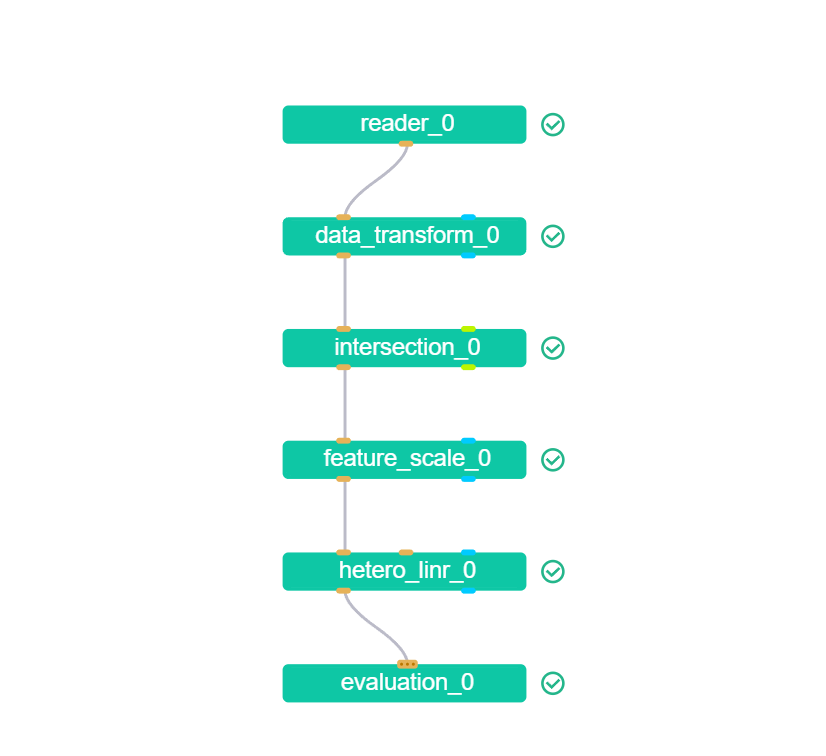

# FATE框架组件运行详细研究——详细版

以纵向联邦线性回归任务为例

#### 任务配置文件

hetero_linr_conf.json

```json
{
    "dsl_version": 2,
    "initiator": {
        "role": "guest",
        "party_id": 10000
    },
    "role": {
        "guest": [
            10000
        ],
        "host": [
            9999
        ]
    },
    "job_parameters": {
        "common": {
            "job_type": "train"
        }
    },
    "component_parameters": {
        "role": {
            "host": {
                "0": {
                    "data_transform_0": {
                        "with_label": false
                    },
                    "reader_0": {
                        "table": {
                            "name": "my_linr_test_host",
                            "namespace": "test"
                        }
                    }
                }
            },
            "guest": {
                "0": {
                    "data_transform_0": {
                        "with_label": true,
                        "label_name": "y",
                        "label_type": "float",
                        "output_format": "dense"
                    },
                    "reader_0": {
                        "table": {
                            "name": "my_linr_test_guest",
                            "namespace": "test"
                        }
                    }
                }
            }
        },
        "common": {
            "hetero_linr_0": {
                "penalty": "L2",
                "tol": 0.001,
                "alpha": 0.01,
                "optimizer": "sgd",
                "batch_size": -1,
                "learning_rate": 0.15,
                "init_param": {
                    "init_method": "zeros"
                },
                "max_iter": 20,
                "early_stop": "weight_diff",
                "decay": 0.0,
                "decay_sqrt": false,
                "reveal_every_iter": true
            },
            "evaluation_0": {
                "eval_type": "regression",
                "pos_label": 1
            },
            "feature_scale_0": {
                "method": "min_max_scale",
                "mode": "cap",
                "feat_upper": 1,
                "feat_lower": 0
            }
        }
    }
}
```

#### 任务DSL文件

hetero_linr_dsl.json

```json
{
    "components": {
        "reader_0": {
            "module": "Reader",
            "output": {
                "data": [
                    "data"
                ]
            }
        },
        "data_transform_0": {
            "module": "DataTransform",
            "input": {
                "data": {
                    "data": [
                        "reader_0.data"
                    ]
                }
            },
            "output": {
                "data": [
                    "data"
                ],
                "model": [
                    "model"
                ]
            }
        },
        "intersection_0": {
            "module": "Intersection",
            "input": {
                "data": {
                    "data": [
                        "data_transform_0.data"
                    ]
                }
            },
            "output": {
                "data": [
                    "data"
                ],
                "cache": [
                    "cache"
                ]
            }
        },
        "feature_scale_0":{
            "module": "FeatureScale",
            "input": {
                "data": {
                    "data": [
                        "intersection_0.data"
                    ]
                }
            },
            "output": {
                "data": [
                    "data"
                ]
            }
        },
        "hetero_linr_0": {
            "module": "HeteroSSHELinR",
            "input": {
                "data": {
                    "train_data": [
                        "feature_scale_0.data"
                    ]
                }
            },
            "output": {
                "data": [
                    "data"
                ],
                "model": [
                    "model"
                ]
            }
        },
        "evaluation_0": {
            "module": "Evaluation",
            "input": {
                "data": {
                    "data": [
                        "hetero_linr_0.data"
                    ]
                }
            },
            "output": {
                "data": [
                    "data"
                ]
            }
        }
    }
}
```

#### 任务图




## 结合源码以及日志（DEBUG级别）分析

### Reader组件

#### 日志

```
[INFO] [2023-10-28 14:29:52,669] [202310281429459592480] [528651:139890981195776] - [base_worker.run] [line:129]: enter TaskExecutor worker in subprocess, pid: 528651
[INFO] [2023-10-28 14:29:52,670] [202310281429459592480] [528651:139890981195776] - [base_worker.run] [line:132]: log level: DEBUG
[INFO] [2023-10-28 14:29:52,670] [202310281429459592480] [528651:139890981195776] - [base_worker.run] [line:134]: SPARK_HOME: None
[INFO] [2023-10-28 14:29:52,670] [202310281429459592480] [528651:139890981195776] - [base_worker.run] [line:134]: PROCESS_ROLE: worker
[INFO] [2023-10-28 14:29:52,670] [202310281429459592480] [528651:139890981195776] - [base_worker.run] [line:134]: PYTHONPATH: /home/lab/federated_learning/fate/from_src_build/FATE/fateflow/python:/home/lab/federated_learning/fate/from_src_build/FATE/python:/home/lab/federated_learning/fate/from_src_build/FATE/fateflow/python
[INFO] [2023-10-28 14:29:52,670] [202310281429459592480] [528651:139890981195776] - [base_worker.run] [line:134]: FATE_DEPLOY_BASE: /home/lab/federated_learning/fate/from_src_build/FATE
[INFO] [2023-10-28 14:29:52,671] [202310281429459592480] [528651:139890981195776] - [base_worker.run] [line:134]: FATE_JOB_ID: 202310281429459592480
[INFO] [2023-10-28 14:29:52,671] [202310281429459592480] [528651:139890981195776] - [base_worker.run] [line:134]: VIRTUAL_ENV: /home/lab/federated_learning/fate/from_src_build/FATE/fate_venv
[INFO] [2023-10-28 14:29:52,853] [202310281429459592480] [528651:139890981195776] - [resource_manager.register_engine] [line:67]: update computing engine STANDALONE fate_on_standalone registration information
[INFO] [2023-10-28 14:29:52,858] [202310281429459592480] [528651:139890981195776] - [resource_manager.register_engine] [line:67]: update computing engine EGGROLL fate_on_eggroll registration information
[INFO] [2023-10-28 14:29:52,862] [202310281429459592480] [528651:139890981195776] - [resource_manager.register_engine] [line:67]: update computing engine SPARK fate_on_spark registration information
[INFO] [2023-10-28 14:29:52,867] [202310281429459592480] [528651:139890981195776] - [resource_manager.register_engine] [line:67]: update computing engine LINKIS_SPARK fate_on_spark registration information
[INFO] [2023-10-28 14:29:52,871] [202310281429459592480] [528651:139890981195776] - [resource_manager.register_engine] [line:67]: update storage engine STANDALONE fate_on_standalone registration information
[INFO] [2023-10-28 14:29:52,875] [202310281429459592480] [528651:139890981195776] - [resource_manager.register_engine] [line:67]: update storage engine EGGROLL fate_on_eggroll registration information
[INFO] [2023-10-28 14:29:52,879] [202310281429459592480] [528651:139890981195776] - [resource_manager.register_engine] [line:67]: update storage engine HDFS fate_on_spark registration information
[INFO] [2023-10-28 14:29:52,884] [202310281429459592480] [528651:139890981195776] - [resource_manager.register_engine] [line:67]: update storage engine HIVE fate_on_spark registration information
[INFO] [2023-10-28 14:29:52,889] [202310281429459592480] [528651:139890981195776] - [resource_manager.register_engine] [line:67]: update storage engine LINKIS_HIVE fate_on_spark registration information
[INFO] [2023-10-28 14:29:52,892] [202310281429459592480] [528651:139890981195776] - [resource_manager.register_engine] [line:67]: update federation engine STANDALONE fate_on_standalone registration information
[INFO] [2023-10-28 14:29:52,897] [202310281429459592480] [528651:139890981195776] - [resource_manager.register_engine] [line:67]: update federation engine EGGROLL fate_on_eggroll registration information
[INFO] [2023-10-28 14:29:52,901] [202310281429459592480] [528651:139890981195776] - [resource_manager.register_engine] [line:67]: update federation engine RABBITMQ fate_on_spark registration information
[INFO] [2023-10-28 14:29:52,905] [202310281429459592480] [528651:139890981195776] - [resource_manager.register_engine] [line:67]: update federation engine PULSAR fate_on_spark registration information
[INFO] [2023-10-28 14:29:52,906] [202310281429459592480] [528651:139890981195776] - [task_executor._run_] [line:56]: run reader_0 202310281429459592480_reader_0 0 on guest 10000 task
[INFO] [2023-10-28 14:29:53,203] [202310281429459592480] [528651:139890981195776] - [task_executor._run_] [line:82]: user name:
[INFO] [2023-10-28 14:29:53,204] [202310281429459592480] [528651:139890981195776] - [task_base_worker.report_task_info_to_driver] [line:114]: report TaskExecutor 202310281429459592480_reader_0 0 guest 10000 to driver:
{'job_id': '202310281429459592480', 'component_name': 'reader_0', 'task_id': '202310281429459592480_reader_0', 'task_version': '0', 'role': 'guest', 'party_id': '10000', 'run_ip': '127.0.0.1', 'run_pid': 528651, 'run_port': '9380', 'party_status': 'running'}
[INFO] [2023-10-28 14:29:53,204] [202310281429459592480] [528651:139890981195776] - [control_client.report_task] [line:39]: request update job 202310281429459592480 task 202310281429459592480_reader_0 0 on guest 10000
[INFO] [2023-10-28 14:29:53,239] [202310281429459592480] [528651:139890981195776] - [task_executor._run_] [line:124]: previous_components_parameters:
{}
[INFO] [2023-10-28 14:29:53,307] [202310281429459592480] [528651:139890981195776] - [task_executor._run_] [line:131]: component parameters on party:
{
    "dsl_version": 2,
    "initiator": {
        "role": "guest",
        "party_id": 10000
    },
    "role": {
        "guest": [
            10000
        ],
        "host": [
            9999
        ]
    },
    "job_parameters": {
        "common": {
            "job_type": "train",
            "inheritance_info": {},
            "computing_engine": "STANDALONE",
            "engines_address": {},
            "federated_mode": "SINGLE",
            "task_parallelism": 1,
            "computing_partitions": 4,
            "federated_status_collect_type": "PUSH",
            "model_id": "guest-10000#host-9999#model",
            "model_version": "202310281429459592480",
            "auto_retries": 0,
            "auto_retry_delay": 1,
            "eggroll_run": {},
            "spark_run": {},
            "rabbitmq_run": {},
            "pulsar_run": {},
            "adaptation_parameters": {
                "task_nodes": 1,
                "task_cores_per_node": 4,
                "task_memory_per_node": 0,
                "request_task_cores": 4,
                "if_initiator_baseline": true
            },
            "task_conf": {},
            "roles": {
                "guest": [
                    10000
                ],
                "host": [
                    9999
                ]
            },
            "role_parameters": {}
        }
    },
    "conf_path": "hetero_linr_conf.json",
    "dsl_path": "hetero_linr_dsl.json",
    "local": {
        "role": "guest",
        "party_id": 10000
    },
    "module": "Reader",
    "CodePath": "Reader",
    "ComponentParam": {
        "table": {
            "name": "my_linr_test_guest",
            "namespace": "test"
        },
        "_name": "Reader#reader_0"
    },
    "ComponentParameterSource": "reader_0"
}
[INFO] [2023-10-28 14:29:53,331] [202310281429459592480] [528651:139890981195776] - [_session.__init__] [line:54]: using engines: {'computing': 'STANDALONE', 'federation': 'STANDALONE', 'storage': 'STANDALONE', 'federated_mode': 'SINGLE'}
[INFO] [2023-10-28 14:29:53,332] [202310281429459592480] [528651:139890981195776] - [_session.__init__] [line:70]: create manager session 202310281429459592480_reader_0_0_guest_10000
[INFO] [2023-10-28 14:29:53,332] [202310281429459592480] [528651:139890981195776] - [db_models.init_database_tables] [line:85]: start create table SessionRecord
[INFO] [2023-10-28 14:29:53,335] [202310281429459592480] [528651:139890981195776] - [db_models.init_database_tables] [line:88]: create table success: SessionRecord
[INFO] [2023-10-28 14:29:53,335] [202310281429459592480] [528651:139890981195776] - [db_models.init_database_tables] [line:85]: start create table StorageConnectorModel
[INFO] [2023-10-28 14:29:53,336] [202310281429459592480] [528651:139890981195776] - [db_models.init_database_tables] [line:88]: create table success: StorageConnectorModel
[INFO] [2023-10-28 14:29:53,336] [202310281429459592480] [528651:139890981195776] - [db_models.init_database_tables] [line:85]: start create table StorageTableMetaModel
[INFO] [2023-10-28 14:29:53,337] [202310281429459592480] [528651:139890981195776] - [db_models.init_database_tables] [line:88]: create table success: StorageTableMetaModel
[INFO] [2023-10-28 14:29:53,337] [202310281429459592480] [528651:139890981195776] - [_session.save_record] [line:343]: try to save session record for manager 202310281429459592480_reader_0_0_guest_10000, computing STANDALONE 202310281429459592480_reader_0_0_guest_10000
[INFO] [2023-10-28 14:29:53,342] [202310281429459592480] [528651:139890981195776] - [_session.save_record] [line:363]: save session record for manager 202310281429459592480_reader_0_0_guest_10000, computing STANDALONE 202310281429459592480_reader_0_0_guest_10000 successfully
[INFO] [2023-10-28 14:29:53,404] [202310281429459592480] [528651:139890981195776] - [_session.save_record] [line:343]: try to save session record for manager 202310281429459592480_reader_0_0_guest_10000, federation STANDALONE 202310281429459592480_reader_0_0
[INFO] [2023-10-28 14:29:53,410] [202310281429459592480] [528651:139890981195776] - [_session.save_record] [line:363]: save session record for manager 202310281429459592480_reader_0_0_guest_10000, federation STANDALONE 202310281429459592480_reader_0_0 successfully
[DEBUG] [2023-10-28 14:29:53,427] [202310281429459592480] [528651:139890981195776] - [_federation.__init__] [line:14]: [federation.standalone]init federation: standalone_session=<fate_arch._standalone.Session object at 0x7f3ad868dd00>, federation_session_id=202310281429459592480_reader_0_0, party=Party(role=guest, party_id=10000)
[DEBUG] [2023-10-28 14:29:53,428] [202310281429459592480] [528651:139890981195776] - [_federation.__init__] [line:24]: [federation.standalone]init federation context done
[INFO] [2023-10-28 14:29:53,428] [202310281429459592480] [528651:139890981195776] - [task_executor._run_] [line:158]: run reader_0 202310281429459592480_reader_0 0 on guest 10000 task
[INFO] [2023-10-28 14:29:53,428] [202310281429459592480] [528651:139890981195776] - [task_executor._run_] [line:159]: component parameters on party:
{
    "dsl_version": 2,
    "initiator": {
        "role": "guest",
        "party_id": 10000
    },
    "role": {
        "guest": [
            10000
        ],
        "host": [
            9999
        ]
    },
    "job_parameters": {
        "job_type": "train",
        "inheritance_info": {},
        "computing_engine": "STANDALONE",
        "federation_engine": "STANDALONE",
        "storage_engine": "STANDALONE",
        "engines_address": {
            "computing": {
                "cores_per_node": 20,
                "nodes": 1
            },
            "federation": {
                "cores_per_node": 20,
                "nodes": 1
            },
            "storage": {
                "cores_per_node": 20,
                "nodes": 1
            }
        },
        "federated_mode": "SINGLE",
        "task_parallelism": 1,
        "computing_partitions": 4,
        "federated_status_collect_type": "PUSH",
        "model_id": "guest-10000#host-9999#model",
        "model_version": "202310281429459592480",
        "auto_retries": 0,
        "auto_retry_delay": 1,
        "eggroll_run": {
            "eggroll.session.processors.per.node": 4
        },
        "spark_run": {},
        "rabbitmq_run": {},
        "pulsar_run": {},
        "adaptation_parameters": {
            "task_nodes": 1,
            "task_cores_per_node": 4,
            "task_memory_per_node": 0,
            "request_task_cores": 4,
            "if_initiator_baseline": false
        },
        "task_conf": {},
        "roles": {
            "guest": [
                10000
            ],
            "host": [
                9999
            ]
        },
        "role_parameters": {}
    },
    "conf_path": "hetero_linr_conf.json",
    "dsl_path": "hetero_linr_dsl.json",
    "local": {
        "role": "guest",
        "party_id": 10000
    },
    "module": "Reader",
    "CodePath": "Reader",
    "ComponentParam": {
        "table": {
            "name": "my_linr_test_guest",
            "namespace": "test"
        },
        "_name": "Reader#reader_0"
    },
    "ComponentParameterSource": "reader_0"
}
[INFO] [2023-10-28 14:29:53,428] [202310281429459592480] [528651:139890981195776] - [task_executor._run_] [line:160]: task input dsl {}
[INFO] [2023-10-28 14:29:53,428] [202310281429459592480] [528651:139890981195776] - [task_executor._run_] [line:171]: task input args {'job_parameters': <fate_flow.entity._run_parameters.RunParameters object at 0x7f3ae5f1ca60>}
[INFO] [2023-10-28 14:29:53,429] [202310281429459592480] [528651:139890981195776] - [task_executor._run_] [line:172]: datasets None
[INFO] [2023-10-28 14:29:53,429] [202310281429459592480] [528651:139890981195776] - [task_executor._run_] [line:210]: profile logging is disabled
[INFO] [2023-10-28 14:29:53,435] [202310281429459592480] [528651:139890981195776] - [_session.save_record] [line:343]: try to save session record for manager 202310281429459592480_reader_0_0_guest_10000, storage STANDALONE 202310281429459592480_reader_0_0_guest_10000_storage_6784da15-755b-11ee-b069-3b2df93b5524
[INFO] [2023-10-28 14:29:53,440] [202310281429459592480] [528651:139890981195776] - [_session.save_record] [line:363]: save session record for manager 202310281429459592480_reader_0_0_guest_10000, storage STANDALONE 202310281429459592480_reader_0_0_guest_10000_storage_6784da15-755b-11ee-b069-3b2df93b5524 successfully
[INFO] [2023-10-28 14:29:53,475] [202310281429459592480] [528651:139890981195776] - [reader._run] [line:107]: the STANDALONE input table needs to be transform format
[INFO] [2023-10-28 14:29:53,476] [202310281429459592480] [528651:139890981195776] - [reader._run] [line:110]: reader create storage session2
[INFO] [2023-10-28 14:29:53,483] [202310281429459592480] [528651:139890981195776] - [reader.save_table] [line:206]: start copying table
[INFO] [2023-10-28 14:29:53,483] [202310281429459592480] [528651:139890981195776] - [reader.save_table] [line:207]: source table name: my_linr_test_guest namespace: test engine: STANDALONE
[INFO] [2023-10-28 14:29:53,483] [202310281429459592480] [528651:139890981195776] - [reader.save_table] [line:210]: destination table name: 6784da14755b11eeb0693b2df93b5524 namespace: output_data_202310281429459592480_reader_0_0 engine: STANDALONE
[INFO] [2023-10-28 14:29:53,540] [202310281429459592480] [528651:139890981195776] - [reader.to_save] [line:240]: dest schema: {'header': 'y,x1', 'sid': 'id', 'meta': {}}
[INFO] [2023-10-28 14:29:53,551] [202310281429459592480] [528651:139890981195776] - [reader.to_save] [line:247]: save output_data_202310281429459592480_reader_0_0 6784da14755b11eeb0693b2df93b5524 success
[INFO] [2023-10-28 14:29:53,562] [202310281429459592480] [528651:139890981195776] - [tracker_client.log_output_data_info] [line:234]: Request save job 202310281429459592480 task 202310281429459592480_reader_0 0 on guest 10000 data data info
[INFO] [2023-10-28 14:29:53,585] [202310281429459592480] [528651:139890981195776] - [reader.data_info_display] [line:307]: data info header: ['y', 'x1']
[INFO] [2023-10-28 14:29:53,585] [202310281429459592480] [528651:139890981195776] - [tracker_client.set_metric_meta_common] [line:103]: Request save job 202310281429459592480 task 202310281429459592480_reader_0 0 on guest 10000 metric reader_namespace reader_name meta
[INFO] [2023-10-28 14:29:53,598] [202310281429459592480] [528651:139890981195776] - [_session.wait_remote_all_done] [line:494]: remote futures: set(), waiting...
[INFO] [2023-10-28 14:29:53,598] [202310281429459592480] [528651:139890981195776] - [_session.wait_remote_all_done] [line:496]: remote futures: set(), all done
[INFO] [2023-10-28 14:29:53,598] [202310281429459592480] [528651:139890981195776] - [task_executor._run_] [line:214]: task output dsl {'data': ['data']}
[INFO] [2023-10-28 14:29:53,599] [202310281429459592480] [528651:139890981195776] - [task_executor._run_] [line:215]: task output data [None]
[INFO] [2023-10-28 14:29:53,599] [202310281429459592480] [528651:139890981195776] - [task_base_worker.report_task_info_to_driver] [line:114]: report TaskExecutor 202310281429459592480_reader_0 0 guest 10000 to driver:
{'job_id': '202310281429459592480', 'component_name': 'reader_0', 'task_id': '202310281429459592480_reader_0', 'task_version': '0', 'role': 'guest', 'party_id': '10000', 'run_ip': '127.0.0.1', 'run_pid': 528651, 'run_port': '9380', 'party_status': 'success', 'end_time': 1698474593599, 'elapsed': 693}
[INFO] [2023-10-28 14:29:53,599] [202310281429459592480] [528651:139890981195776] - [control_client.report_task] [line:39]: request update job 202310281429459592480 task 202310281429459592480_reader_0 0 on guest 10000
[INFO] [2023-10-28 14:29:53,625] [202310281429459592480] [528651:139890981195776] - [task_executor._run_] [line:286]: finish reader_0 202310281429459592480_reader_0 0 on guest 10000 with success
[INFO] [2023-10-28 14:29:53,625] [202310281429459592480] [528651:139890981195776] - [base_worker.run] [line:157]: worker TaskExecutor, process role: ProcessRole.WORKER, pid: 528651, elapsed: 960 ms

```

#### 根据日志结合源码分析

##### base_worker.run

```python
    def run(self, **kwargs):
        result = {}
        code = 0
        message = ""
        start_time = current_timestamp()    # 记录起始时间
        self.run_pid = os.getpid()        # 记录进程id
        try:
            self.args = self.get_args(**kwargs)   # 解析传入参数并赋值给self.args
            if self.args.model_path:    # 如果传入了模型路径，则将模型路径赋值给环境变量MODEL_PATH
                os.environ["MODEL_PATH"] = self.args.model_path
            RuntimeConfig.init_env()    # 初始化环境变量
            role = ProcessRole(os.getenv("PROCESS_ROLE"))
            append_to_parent_log = True    # 是否将日志追加到父进程日志中
            if self.args.is_deepspeed:  # 如果是deepspeed任务
                role = ProcessRole(ProcessRole.WORKER.value)
                append_to_parent_log = False
            RuntimeConfig.set_process_role(role)    # 设置进程角色，driver或者worker
            if RuntimeConfig.PROCESS_ROLE == ProcessRole.WORKER:    # 如果是worker进程，设置相关日志配置
                LoggerFactory.LEVEL = logging.getLevelName(os.getenv("FATE_LOG_LEVEL", "INFO"))
                if os.getenv("EGGROLL_CONTAINER_LOGS_DIR"):
                    # eggroll deepspeed
                    self.args.parent_log_dir = os.path.dirname(os.getenv("EGGROLL_CONTAINER_LOGS_DIR"))
                    self.args.log_dir = os.getenv("EGGROLL_CONTAINER_LOGS_DIR")
                LoggerFactory.set_directory(directory=self.args.log_dir, parent_log_dir=self.args.parent_log_dir,
                                            append_to_parent_log=append_to_parent_log, force=True)
                LOGGER.info(f"enter {self.__class__.__name__} worker in subprocess, pid: {self.run_pid}")
"""
[INFO] [2023-10-28 14:29:52,669] [202310281429459592480] [528651:139890981195776] - [base_worker.run] [line:129]: enter TaskExecutor worker in subprocess, pid: 528651
"""
            else:
                LOGGER.info(f"enter {self.__class__.__name__} worker in driver process, pid: {self.run_pid}")
            LOGGER.info(f"log level: {logging.getLevelName(LoggerFactory.LEVEL)}")
"""
[INFO] [2023-10-28 14:29:52,670] [202310281429459592480] [528651:139890981195776] - [base_worker.run] [line:132]: log level: DEBUG
"""
            for env in {"VIRTUAL_ENV", "PYTHONPATH", "SPARK_HOME", "FATE_DEPLOY_BASE", "PROCESS_ROLE", "FATE_JOB_ID"}:
                LOGGER.info(f"{env}: {os.getenv(env)}")
"""
[INFO] [2023-10-28 14:29:52,670] [202310281429459592480] [528651:139890981195776] - [base_worker.run] [line:134]: SPARK_HOME: None
[INFO] [2023-10-28 14:29:52,670] [202310281429459592480] [528651:139890981195776] - [base_worker.run] [line:134]: PROCESS_ROLE: worker
[INFO] [2023-10-28 14:29:52,670] [202310281429459592480] [528651:139890981195776] - [base_worker.run] [line:134]: PYTHONPATH: /home/lab/federated_learning/fate/from_src_build/FATE/fateflow/python:/home/lab/federated_learning/fate/from_src_build/FATE/python:/home/lab/federated_learning/fate/from_src_build/FATE/fateflow/python
[INFO] [2023-10-28 14:29:52,670] [202310281429459592480] [528651:139890981195776] - [base_worker.run] [line:134]: FATE_DEPLOY_BASE: /home/lab/federated_learning/fate/from_src_build/FATE
[INFO] [2023-10-28 14:29:52,671] [202310281429459592480] [528651:139890981195776] - [base_worker.run] [line:134]: FATE_JOB_ID: 202310281429459592480
[INFO] [2023-10-28 14:29:52,671] [202310281429459592480] [528651:139890981195776] - [base_worker.run] [line:134]: VIRTUAL_ENV: /home/lab/federated_learning/fate/from_src_build/FATE/fate_venv
"""
            if self.args.job_server:    # 如果传入了job_server，则将job_server的ip和端口赋值给环境变量JOB_SERVER_HOST和HTTP_PORT
                RuntimeConfig.init_config(JOB_SERVER_HOST=self.args.job_server.split(':')[0],
                                          HTTP_PORT=self.args.job_server.split(':')[1])
            if not RuntimeConfig.LOAD_COMPONENT_REGISTRY:   # 如果没有加载组件注册表，则加载组件注册表
                ComponentRegistry.load()    # 加载组件注册表，一般不会运行到这里，fateflow在启动时会加载一次组件注册表
            if not RuntimeConfig.LOAD_CONFIG_MANAGER:   # 如果没有加载配置管理器，则加载配置管理器
                ConfigManager.load()    # 加载配置管理器，会进行一系列初始化操作
        ...
        ...
        ...    

```

##### ConfigManager.load

```python
    @classmethod
    def load(cls):
        configs = {
            "job_default_config": JobDefaultConfig.load(),
            "server_registry": ServerRegistry.load(),
        }
        ResourceManager.initialize()    # 初始化资源管理器
        ...
        ...
        ...
```

##### ResourceManager.initialize

```python
    @classmethod
    def initialize(cls):
        engines_config, engine_group_map = engine_utils.get_engines_config_from_conf(group_map=True)
        for engine_type, engine_configs in engines_config.items():
            for engine_name, engine_config in engine_configs.items():
                cls.register_engine(engine_type=engine_type, engine_name=engine_name, engine_entrance=engine_group_map[engine_type][engine_name], engine_config=engine_config)  # 注册引擎
        ...
        ...
        ...
```

##### ResourceManager.register_engine

```python
@classmethod
    @DB.connection_context()
    def register_engine(cls, engine_type, engine_name, engine_entrance, engine_config):
        nodes = engine_config.get("nodes", 1)
        cores = engine_config.get("cores_per_node", 0) * nodes * JobDefaultConfig.total_cores_overweight_percent
        memory = engine_config.get("memory_per_node", 0) * nodes * JobDefaultConfig.total_memory_overweight_percent
        filters = [EngineRegistry.f_engine_type == engine_type, EngineRegistry.f_engine_name == engine_name]
        resources = EngineRegistry.select().where(*filters)
        if resources:
            resource = resources[0]
            update_fields = {}
            update_fields[EngineRegistry.f_engine_config] = engine_config
            update_fields[EngineRegistry.f_cores] = cores
            update_fields[EngineRegistry.f_memory] = memory
            update_fields[EngineRegistry.f_remaining_cores] = EngineRegistry.f_remaining_cores + (
                    cores - resource.f_cores)
            update_fields[EngineRegistry.f_remaining_memory] = EngineRegistry.f_remaining_memory + (
                    memory - resource.f_memory)
            update_fields[EngineRegistry.f_nodes] = nodes
            operate = EngineRegistry.update(update_fields).where(*filters)
            update_status = operate.execute() > 0
            if update_status:
                stat_logger.info(f"update {engine_type} engine {engine_name} {engine_entrance} registration information")
            else:
                stat_logger.info(f"update {engine_type} engine {engine_name} {engine_entrance} registration information takes no effect")
        else:
            resource = EngineRegistry()
            resource.f_create_time = base_utils.current_timestamp()
            resource.f_engine_type = engine_type
            resource.f_engine_name = engine_name
            resource.f_engine_entrance = engine_entrance
            resource.f_engine_config = engine_config

            resource.f_cores = cores
            resource.f_memory = memory
            resource.f_remaining_cores = cores
            resource.f_remaining_memory = memory
            resource.f_nodes = nodes
            try:
                resource.save(force_insert=True)
            except Exception as e:
                stat_logger.warning(e)
            stat_logger.info(f"create {engine_type} engine {engine_name} {engine_entrance} registration information")
"""
[INFO] [2023-10-28 14:29:52,853] [202310281429459592480] [528651:139890981195776] - [resource_manager.register_engine] [line:67]: update computing engine STANDALONE fate_on_standalone registration information
[INFO] [2023-10-28 14:29:52,858] [202310281429459592480] [528651:139890981195776] - [resource_manager.register_engine] [line:67]: update computing engine EGGROLL fate_on_eggroll registration information
[INFO] [2023-10-28 14:29:52,862] [202310281429459592480] [528651:139890981195776] - [resource_manager.register_engine] [line:67]: update computing engine SPARK fate_on_spark registration information
[INFO] [2023-10-28 14:29:52,867] [202310281429459592480] [528651:139890981195776] - [resource_manager.register_engine] [line:67]: update computing engine LINKIS_SPARK fate_on_spark registration information
[INFO] [2023-10-28 14:29:52,871] [202310281429459592480] [528651:139890981195776] - [resource_manager.register_engine] [line:67]: update storage engine STANDALONE fate_on_standalone registration information
[INFO] [2023-10-28 14:29:52,875] [202310281429459592480] [528651:139890981195776] - [resource_manager.register_engine] [line:67]: update storage engine EGGROLL fate_on_eggroll registration information
[INFO] [2023-10-28 14:29:52,879] [202310281429459592480] [528651:139890981195776] - [resource_manager.register_engine] [line:67]: update storage engine HDFS fate_on_spark registration information
[INFO] [2023-10-28 14:29:52,884] [202310281429459592480] [528651:139890981195776] - [resource_manager.register_engine] [line:67]: update storage engine HIVE fate_on_spark registration information
[INFO] [2023-10-28 14:29:52,889] [202310281429459592480] [528651:139890981195776] - [resource_manager.register_engine] [line:67]: update storage engine LINKIS_HIVE fate_on_spark registration information
[INFO] [2023-10-28 14:29:52,892] [202310281429459592480] [528651:139890981195776] - [resource_manager.register_engine] [line:67]: update federation engine STANDALONE fate_on_standalone registration information
[INFO] [2023-10-28 14:29:52,897] [202310281429459592480] [528651:139890981195776] - [resource_manager.register_engine] [line:67]: update federation engine EGGROLL fate_on_eggroll registration information
[INFO] [2023-10-28 14:29:52,901] [202310281429459592480] [528651:139890981195776] - [resource_manager.register_engine] [line:67]: update federation engine RABBITMQ fate_on_spark registration information
[INFO] [2023-10-28 14:29:52,905] [202310281429459592480] [528651:139890981195776] - [resource_manager.register_engine] [line:67]: update federation engine PULSAR fate_on_spark registration information
"""
```

##### ResourceManager.initialize

```python
    @classmethod
    def initialize(cls):
        ...
        ...
        ...
```

##### ConfigManager.load

```python
    @classmethod
    def load(cls):
        ...
        ...
        ...
        RuntimeConfig.load_config_manager()
        return configs
```

##### base_worker.run

```python
    def run(self, **kwargs):
		...
        ...
        ...   
    	result = self._run()    # 执行_run方法
        ...
        ...
        ...   
```

##### BaseTaskWorker.\_run

```python
    def _run(self):
        self.report_info.update({
            "job_id": self.args.job_id,
            "component_name": self.args.component_name,
            "task_id": self.args.task_id,
            "task_version": self.args.task_version,
            "role": self.args.role,
            "party_id": self.args.party_id,
            "run_ip": self.args.run_ip,
            "run_pid": self.run_pid
        })
        self._run_()
```

##### task_executor.\_run\_

```python
    def _run_(self):
        # todo: All function calls where errors should be thrown
        args = self.args
        start_time = current_timestamp()
        try:
            LOGGER.info(f'run {args.component_name} {args.task_id} {args.task_version} on {args.role} {args.party_id} task')
"""
[INFO] [2023-10-28 14:29:52,906] [202310281429459592480] [528651:139890981195776] - [task_executor._run_] [line:56]: run reader_0 202310281429459592480_reader_0 0 on guest 10000 task
"""
            HookManager.init()
            self.report_info.update({
                "job_id": args.job_id,
                "component_name": args.component_name,
                "task_id": args.task_id,
                "task_version": args.task_version,
                "role": args.role,
                "party_id": args.party_id,
                "run_ip": args.run_ip,
                "run_port": args.run_port,
                "run_pid": self.run_pid
            })
            job_configuration = job_utils.get_job_configuration(
                job_id=self.args.job_id,
                role=self.args.role,
                party_id=self.args.party_id
            )
            task_parameters_conf = args.config
            dsl_parser = schedule_utils.get_job_dsl_parser(dsl=job_configuration.dsl,
                                                           runtime_conf=job_configuration.runtime_conf,
                                                           train_runtime_conf=job_configuration.train_runtime_conf,
                                                           pipeline_dsl=None)

            job_parameters = dsl_parser.get_job_parameters(job_configuration.runtime_conf, int(job_configuration.runtime_conf.get("dsl_version", "1")))
            user_name = job_parameters.get(args.role, {}).get(args.party_id, {}).get("user", '')
            LOGGER.info(f"user name:{user_name}")
            task_parameters = RunParameters(**task_parameters_conf)
            job_parameters = task_parameters
            if job_parameters.assistant_role:
                TaskExecutor.monkey_patch()

            job_args_on_party = TaskExecutor.get_job_args_on_party(dsl_parser, job_configuration.runtime_conf_on_party, args.role, args.party_id)
            component = dsl_parser.get_component_info(component_name=args.component_name)
            module_name = component.get_module()
            task_input_dsl = component.get_input()
            task_output_dsl = component.get_output()

            party_model_id = gen_party_model_id(job_parameters.model_id, args.role, args.party_id)
            model_version = job_parameters.model_version if job_parameters.job_type != 'predict' else args.job_id

            kwargs = {
                'job_id': args.job_id,
                'role': args.role,
                'party_id': args.party_id,
                'component_name': args.component_name,
                'task_id': args.task_id,
                'task_version': args.task_version,
                'model_id': job_parameters.model_id,
                # in the prediction job, job_parameters.model_version comes from the training job
                # TODO: prediction job should not affect training job
                'model_version': job_parameters.model_version,
                'component_module_name': module_name,
                'job_parameters': job_parameters,
            }
            tracker = Tracker(**kwargs)
            tracker_client = TrackerClient(**kwargs)
            checkpoint_manager = CheckpointManager(**kwargs)

            predict_tracker_client = None
            if job_parameters.job_type == 'predict':
                kwargs['model_version'] = model_version
                predict_tracker_client = TrackerClient(**kwargs)

            self.report_info["party_status"] = TaskStatus.RUNNING
            self.report_task_info_to_driver()
            ...
            ...
            ...
```

##### BaseTaskWorker.report_task_info_to_driver

```python
    def report_task_info_to_driver(self):
        if not self.args.is_deepspeed:
            LOGGER.info("report {} {} {} {} {} to driver:\n{}".format(
                self.__class__.__name__,
                self.report_info["task_id"],
                self.report_info["task_version"],
                self.report_info["role"],
                self.report_info["party_id"],
                self.report_info
            ))
"""
[INFO] [2023-10-28 14:29:53,204] [202310281429459592480] [528651:139890981195776] - [task_base_worker.report_task_info_to_driver] [line:114]: report TaskExecutor 202310281429459592480_reader_0 0 guest 10000 to driver:
{'job_id': '202310281429459592480', 'component_name': 'reader_0', 'task_id': '202310281429459592480_reader_0', 'task_version': '0', 'role': 'guest', 'party_id': '10000', 'run_ip': '127.0.0.1', 'run_pid': 528651, 'run_port': '9380', 'party_status': 'running'}
"""
            ControllerClient.report_task(self.report_info)
            ...
            ...
            ...
```

##### ControllerClient.report_task

```python
    @classmethod
    def report_task(cls, task_info):
        LOGGER.info("request update job {} task {} {} on {} {}".format(task_info["job_id"], task_info["task_id"],
                                                                       task_info["task_version"], task_info["role"],
                                                                       task_info["party_id"]))
"""
[INFO] [2023-10-28 14:29:53,204] [202310281429459592480] [528651:139890981195776] - [control_client.report_task] [line:39]: request update job 202310281429459592480 task 202310281429459592480_reader_0 0 on guest 10000
"""
        response = api_utils.local_api(
            job_id=task_info["job_id"],
            method='POST',
            endpoint='/party/{}/{}/{}/{}/{}/{}/report'.format(
                task_info["job_id"],
                task_info["component_name"],
                task_info["task_id"],
                task_info["task_version"],
                task_info["role"],
                task_info["party_id"]
            ),
            json_body=task_info)
        return response
```

##### BaseTaskWorker.report_task_info_to_driver

```python
    def report_task_info_to_driver(self):
            ...
            ...
            ...
```

##### task_executor.\_run\_

```python
    def _run_(self):
			...
            ...
            ...
            previous_components_parameters = tracker_client.get_model_run_parameters()
            LOGGER.info(f"previous_components_parameters:\n{json_dumps(previous_components_parameters, indent=4)}")
"""
[INFO] [2023-10-28 14:29:53,239] [202310281429459592480] [528651:139890981195776] - [task_executor._run_] [line:124]: previous_components_parameters:
{}
"""
            component_provider, component_parameters_on_party, user_specified_parameters = \
                ProviderManager.get_component_run_info(dsl_parser=dsl_parser, component_name=args.component_name,
                                                       role=args.role, party_id=args.party_id,
                                                       previous_components_parameters=previous_components_parameters)
            RuntimeConfig.set_component_provider(component_provider)
            LOGGER.info(f"component parameters on party:\n{json_dumps(component_parameters_on_party, indent=4)}")
"""
[INFO] [2023-10-28 14:29:53,307] [202310281429459592480] [528651:139890981195776] - [task_executor._run_] [line:131]: component parameters on party:
{
    "dsl_version": 2,
    "initiator": {
        "role": "guest",
        "party_id": 10000
    },
    "role": {
        "guest": [
            10000
        ],
        "host": [
            9999
        ]
    },
    "job_parameters": {
        "common": {
            "job_type": "train",
            "inheritance_info": {},
            "computing_engine": "STANDALONE",
            "engines_address": {},
            "federated_mode": "SINGLE",
            "task_parallelism": 1,
            "computing_partitions": 4,
            "federated_status_collect_type": "PUSH",
            "model_id": "guest-10000#host-9999#model",
            "model_version": "202310281429459592480",
            "auto_retries": 0,
            "auto_retry_delay": 1,
            "eggroll_run": {},
            "spark_run": {},
            "rabbitmq_run": {},
            "pulsar_run": {},
            "adaptation_parameters": {
                "task_nodes": 1,
                "task_cores_per_node": 4,
                "task_memory_per_node": 0,
                "request_task_cores": 4,
                "if_initiator_baseline": true
            },
            "task_conf": {},
            "roles": {
                "guest": [
                    10000
                ],
                "host": [
                    9999
                ]
            },
            "role_parameters": {}
        }
    },
    "conf_path": "hetero_linr_conf.json",
    "dsl_path": "hetero_linr_dsl.json",
    "local": {
        "role": "guest",
        "party_id": 10000
    },
    "module": "Reader",
    "CodePath": "Reader",
    "ComponentParam": {
        "table": {
            "name": "my_linr_test_guest",
            "namespace": "test"
        },
        "_name": "Reader#reader_0"
    },
    "ComponentParameterSource": "reader_0"
}
"""
            flow_feeded_parameters = {"output_data_name": task_output_dsl.get("data")}

            # init environment, process is shared globally
            RuntimeConfig.init_config(COMPUTING_ENGINE=job_parameters.computing_engine,
                                      FEDERATION_ENGINE=job_parameters.federation_engine,
                                      FEDERATED_MODE=job_parameters.federated_mode)

            if RuntimeConfig.COMPUTING_ENGINE == ComputingEngine.EGGROLL:
                session_options = task_parameters.eggroll_run.copy()
                session_options["python.path"] = os.getenv("PYTHONPATH")
                session_options["python.venv"] = os.getenv("VIRTUAL_ENV")
            else:
                session_options = {}
            sess = session.Session(session_id=args.session_id)
			...
            ...
            ... 
```

##### \_session.\_\_init\_\_

```python
    def __init__(self, session_id: str = None, options=None):
        if options is None:
            options = {}
        engines = engine_utils.get_engines()
        LOGGER.info(f"using engines: {engines}")
"""
[INFO] [2023-10-28 14:29:53,331] [202310281429459592480] [528651:139890981195776] - [_session.__init__] [line:54]: using engines: {'computing': 'STANDALONE', 'federation': 'STANDALONE', 'storage': 'STANDALONE', 'federated_mode': 'SINGLE'}
"""
        computing_type = engines.get(EngineType.COMPUTING, None)
        if computing_type is None:
            raise RuntimeError(f"must set default engines on conf/service_conf.yaml")

        self._computing_type = engines.get(EngineType.COMPUTING, None)
        self._federation_type = engines.get(EngineType.FEDERATION, None)
        self._storage_engine = engines.get(EngineType.STORAGE, None)
        self._computing_session: typing.Optional[CSessionABC] = None
        self._federation_session: typing.Optional[FederationABC] = None
        self._storage_session: typing.Dict[StorageSessionABC] = {}
        self._parties_info: typing.Optional[PartiesInfo] = None
        self._all_party_info: typing.List[Party] = []
        self._session_id = str(uuid.uuid1()) if not session_id else session_id
        self._logger = LOGGER if options.get("logger", None) is None else options.get("logger", None)

        self._logger.info(f"create manager session {self._session_id}")
"""
[INFO] [2023-10-28 14:29:53,332] [202310281429459592480] [528651:139890981195776] - [_session.__init__] [line:70]: create manager session 202310281429459592480_reader_0_0_guest_10000
"""
        # init meta db
        init_database_tables()
			...
            ...
            ...
```

##### db_models.init_database_tables

```python
@DB.connection_context()
def init_database_tables():
    members = inspect.getmembers(sys.modules[__name__], inspect.isclass)
    table_objs = []
    create_failed_list = []
    for name, obj in members:
        if obj != DataBaseModel and issubclass(obj, DataBaseModel):
            table_objs.append(obj)
            LOGGER.info(f"start create table {obj.__name__}")
            try:
                obj.create_table()
                LOGGER.info(f"create table success: {obj.__name__}")
            except Exception as e:
                LOGGER.exception(e)
                create_failed_list.append(obj.__name__)
"""
[INFO] [2023-10-28 14:29:53,332] [202310281429459592480] [528651:139890981195776] - [db_models.init_database_tables] [line:85]: start create table SessionRecord
[INFO] [2023-10-28 14:29:53,335] [202310281429459592480] [528651:139890981195776] - [db_models.init_database_tables] [line:88]: create table success: SessionRecord
[INFO] [2023-10-28 14:29:53,335] [202310281429459592480] [528651:139890981195776] - [db_models.init_database_tables] [line:85]: start create table StorageConnectorModel
[INFO] [2023-10-28 14:29:53,336] [202310281429459592480] [528651:139890981195776] - [db_models.init_database_tables] [line:88]: create table success: StorageConnectorModel
[INFO] [2023-10-28 14:29:53,336] [202310281429459592480] [528651:139890981195776] - [db_models.init_database_tables] [line:85]: start create table StorageTableMetaModel
[INFO] [2023-10-28 14:29:53,337] [202310281429459592480] [528651:139890981195776] - [db_models.init_database_tables] [line:88]: create table success: StorageTableMetaModel
"""
    if create_failed_list:
        LOGGER.info(f"create tables failed: {create_failed_list}")
        raise Exception(f"create tables failed: {create_failed_list}")
```

##### \_session.\_\_init\_\_

```python
    def __init__(self, session_id: str = None, options=None):
			...
            ...
            ...
```

##### task_executor.\_run\_

```python
    def _run_(self):
			...
            ...
            ...
            sess.as_global()
            sess.init_computing(computing_session_id=args.session_id, options=session_options)
"""
[INFO] [2023-10-28 14:29:53,337] [202310281429459592480] [528651:139890981195776] - [_session.save_record] [line:343]: try to save session record for manager 202310281429459592480_reader_0_0_guest_10000, computing STANDALONE 202310281429459592480_reader_0_0_guest_10000
[INFO] [2023-10-28 14:29:53,342] [202310281429459592480] [528651:139890981195776] - [_session.save_record] [line:363]: save session record for manager 202310281429459592480_reader_0_0_guest_10000, computing STANDALONE 202310281429459592480_reader_0_0_guest_10000 successfully
"""
            component_parameters_on_party["job_parameters"] = job_parameters.to_dict()
            roles = job_configuration.runtime_conf["role"]
            if set(roles) == {"local"}:
                LOGGER.info(f"only local roles, pass init federation")
            else:
                if self.is_master:
                    sess.init_federation(federation_session_id=args.federation_session_id,
                                         runtime_conf=component_parameters_on_party,
                                         service_conf=job_parameters.engines_address.get(EngineType.FEDERATION, {}))
"""
[INFO] [2023-10-28 14:29:53,404] [202310281429459592480] [528651:139890981195776] - [_session.save_record] [line:343]: try to save session record for manager 202310281429459592480_reader_0_0_guest_10000, federation STANDALONE 202310281429459592480_reader_0_0
[INFO] [2023-10-28 14:29:53,410] [202310281429459592480] [528651:139890981195776] - [_session.save_record] [line:363]: save session record for manager 202310281429459592480_reader_0_0_guest_10000, federation STANDALONE 202310281429459592480_reader_0_0 successfully
[DEBUG] [2023-10-28 14:29:53,427] [202310281429459592480] [528651:139890981195776] - [_federation.__init__] [line:14]: [federation.standalone]init federation: standalone_session=<fate_arch._standalone.Session object at 0x7f3ad868dd00>, federation_session_id=202310281429459592480_reader_0_0, party=Party(role=guest, party_id=10000)
[DEBUG] [2023-10-28 14:29:53,428] [202310281429459592480] [528651:139890981195776] - [_federation.__init__] [line:24]: [federation.standalone]init federation context done
"""
            LOGGER.info(f'run {args.component_name} {args.task_id} {args.task_version} on {args.role} {args.party_id} task')
            LOGGER.info(f"component parameters on party:\n{json_dumps(component_parameters_on_party, indent=4)}")
            LOGGER.info(f"task input dsl {task_input_dsl}")
"""
[INFO] [2023-10-28 14:29:53,428] [202310281429459592480] [528651:139890981195776] - [task_executor._run_] [line:158]: run reader_0 202310281429459592480_reader_0 0 on guest 10000 task
[INFO] [2023-10-28 14:29:53,428] [202310281429459592480] [528651:139890981195776] - [task_executor._run_] [line:159]: component parameters on party:
{
    "dsl_version": 2,
    "initiator": {
        "role": "guest",
        "party_id": 10000
    },
    "role": {
        "guest": [
            10000
        ],
        "host": [
            9999
        ]
    },
    "job_parameters": {
        "job_type": "train",
        "inheritance_info": {},
        "computing_engine": "STANDALONE",
        "federation_engine": "STANDALONE",
        "storage_engine": "STANDALONE",
        "engines_address": {
            "computing": {
                "cores_per_node": 20,
                "nodes": 1
            },
            "federation": {
                "cores_per_node": 20,
                "nodes": 1
            },
            "storage": {
                "cores_per_node": 20,
                "nodes": 1
            }
        },
        "federated_mode": "SINGLE",
        "task_parallelism": 1,
        "computing_partitions": 4,
        "federated_status_collect_type": "PUSH",
        "model_id": "guest-10000#host-9999#model",
        "model_version": "202310281429459592480",
        "auto_retries": 0,
        "auto_retry_delay": 1,
        "eggroll_run": {
            "eggroll.session.processors.per.node": 4
        },
        "spark_run": {},
        "rabbitmq_run": {},
        "pulsar_run": {},
        "adaptation_parameters": {
            "task_nodes": 1,
            "task_cores_per_node": 4,
            "task_memory_per_node": 0,
            "request_task_cores": 4,
            "if_initiator_baseline": false
        },
        "task_conf": {},
        "roles": {
            "guest": [
                10000
            ],
            "host": [
                9999
            ]
        },
        "role_parameters": {}
    },
    "conf_path": "hetero_linr_conf.json",
    "dsl_path": "hetero_linr_dsl.json",
    "local": {
        "role": "guest",
        "party_id": 10000
    },
    "module": "Reader",
    "CodePath": "Reader",
    "ComponentParam": {
        "table": {
            "name": "my_linr_test_guest",
            "namespace": "test"
        },
        "_name": "Reader#reader_0"
    },
    "ComponentParameterSource": "reader_0"
}
[INFO] [2023-10-28 14:29:53,428] [202310281429459592480] [528651:139890981195776] - [task_executor._run_] [line:160]: task input dsl {}
"""
            task_run_args, input_table_list = self.get_task_run_args(job_id=args.job_id, role=args.role, party_id=args.party_id,
                                                                     task_id=args.task_id,
                                                                     task_version=args.task_version,
                                                                     job_args=job_args_on_party,
                                                                     job_parameters=job_parameters,
                                                                     task_parameters=task_parameters,
                                                                     input_dsl=task_input_dsl,
                                                                     )
            if module_name in {"Upload", "Download", "Reader", "Writer", "Checkpoint"}:
                task_run_args["job_parameters"] = job_parameters
            LOGGER.info(f"task input args {task_run_args}")
            LOGGER.info(f"datasets {task_run_args.get('data', None)}")
"""
[INFO] [2023-10-28 14:29:53,428] [202310281429459592480] [528651:139890981195776] - [task_executor._run_] [line:171]: task input args {'job_parameters': <fate_flow.entity._run_parameters.RunParameters object at 0x7f3ae5f1ca60>}
[INFO] [2023-10-28 14:29:53,429] [202310281429459592480] [528651:139890981195776] - [task_executor._run_] [line:172]: datasets None
"""

            need_run = component_parameters_on_party.get("ComponentParam", {}).get("need_run", True)
            provider_interface = provider_utils.get_provider_interface(provider=component_provider)
            run_object = provider_interface.get(module_name, ComponentRegistry.get_provider_components(provider_name=component_provider.name, provider_version=component_provider.version)).get_run_obj(self.args.role)
            flow_feeded_parameters.update({"table_info": input_table_list})
            cpn_input = ComponentInput(
                tracker=tracker_client,
                checkpoint_manager=checkpoint_manager,
                task_version_id=job_utils.generate_task_version_id(args.task_id, args.task_version),
                parameters=component_parameters_on_party["ComponentParam"],
                datasets=task_run_args.get("data", None),
                caches=task_run_args.get("cache", None),
                models=dict(
                    model=task_run_args.get("model"),
                    isometric_model=task_run_args.get("isometric_model"),
                ),
                job_parameters=job_parameters,
                roles=dict(
                    role=component_parameters_on_party["role"],
                    local=component_parameters_on_party["local"],
                ),
                flow_feeded_parameters=flow_feeded_parameters,
            )
            profile_log_enabled = False
            try:
                if int(os.getenv("FATE_PROFILE_LOG_ENABLED", "0")) > 0:
                    profile_log_enabled = True
            except Exception as e:
                LOGGER.warning(e)
            if profile_log_enabled:
                # add profile logs
                LOGGER.info("profile logging is enabled")
                profile.profile_start()
                cpn_output = run_object.run(cpn_input)
                sess.wait_remote_all_done()
                profile.profile_ends()
            else:
                LOGGER.info("profile logging is disabled")
"""
[INFO] [2023-10-28 14:29:53,429] [202310281429459592480] [528651:139890981195776] - [task_executor._run_] [line:210]: profile logging is disabled
"""
                cpn_output = run_object.run(cpn_input)
			...
            ...
            ...
```

##### ComponentBase.run

```python
    def run(self, cpn_input: ComponentInputProtocol, retry: bool = True):
        self.task_version_id = cpn_input.task_version_id
        self.tracker = cpn_input.tracker
        self.checkpoint_manager = cpn_input.checkpoint_manager

        # retry
        if (
            retry
            and hasattr(self, '_retry')
            and callable(self._retry)
            and self.checkpoint_manager is not None
            and self.checkpoint_manager.latest_checkpoint is not None
        ):
            self._retry(cpn_input=cpn_input)
        # normal
        else:
            self._run(cpn_input=cpn_input)

			...
            ...
            ...
```

##### Reader._run

```python
    def _run(self, cpn_input: ComponentInputProtocol):
        self.parameters = cpn_input.parameters
        self.job_parameters = cpn_input.job_parameters
        output_storage_address = self.job_parameters.engines_address[EngineType.STORAGE]
        # only support one input table
        table_key = [key for key in self.parameters.keys()][0]

        input_table_namespace, input_table_name = self.get_input_table_info(
            parameters=self.parameters[table_key],
            role=self.tracker.role,
            party_id=self.tracker.party_id,
        )
        (
            output_table_namespace,
            output_table_name,
        ) = default_output_info(
            task_id=self.tracker.task_id, 
            task_version=self.tracker.task_version,
            output_type="data",
        )
        (
            input_table_meta,
            output_table_address,
            output_table_engine,
        ) = self.convert_check(
            input_name=input_table_name,
            input_namespace=input_table_namespace,
            output_name=output_table_name,
            output_namespace=output_table_namespace,
            computing_engine=self.job_parameters.computing_engine,
            output_storage_address=output_storage_address,
        )
        sess = Session.get_global() # 获取当前全局会话对象

        input_table = sess.get_table(
            name=input_table_meta.get_name(), namespace=input_table_meta.get_namespace()
        )
"""
[INFO] [2023-10-28 14:29:53,435] [202310281429459592480] [528651:139890981195776] - [_session.save_record] [line:343]: try to save session record for manager 202310281429459592480_reader_0_0_guest_10000, storage STANDALONE 202310281429459592480_reader_0_0_guest_10000_storage_6784da15-755b-11ee-b069-3b2df93b5524
[INFO] [2023-10-28 14:29:53,440] [202310281429459592480] [528651:139890981195776] - [_session.save_record] [line:363]: save session record for manager 202310281429459592480_reader_0_0_guest_10000, storage STANDALONE 202310281429459592480_reader_0_0_guest_10000_storage_6784da15-755b-11ee-b069-3b2df93b5524 successfully
"""
        # update real count to meta info
        input_table.count()
        # Table replication is required
        if input_table_meta.get_engine() != output_table_engine:
            LOGGER.info(
                f"the {input_table_meta.get_engine()} engine input table needs to be converted to {output_table_engine} engine to support computing engine {self.job_parameters.computing_engine}"
            )
        else:
            LOGGER.info(
                f"the {input_table_meta.get_engine()} input table needs to be transform format"
            )
"""
[INFO] [2023-10-28 14:29:53,475] [202310281429459592480] [528651:139890981195776] - [reader._run] [line:107]: the STANDALONE input table needs to be transform format
"""
        LOGGER.info("reader create storage session2")
"""
[INFO] [2023-10-28 14:29:53,476] [202310281429459592480] [528651:139890981195776] - [reader._run] [line:110]: reader create storage session2
"""
        output_table_session = sess.storage(storage_engine=output_table_engine) # 建立存储会话
        output_table = output_table_session.create_table(   # 创建存储表，用于存储输出数据
            address=output_table_address,
            name=output_table_name,
            namespace=output_table_namespace,
            partitions=input_table_meta.partitions,
            origin=StorageTableOrigin.READER
        )
        self.save_table(src_table=input_table, dest_table=output_table) # 将输入表的数据存储到输出表中，其实就是将输入表的数据复制到输出表中
			...
            ...
            ...
```

##### Reader.save_table

```python
    def save_table(self, src_table: StorageTableABC, dest_table: StorageTableABC):
        LOGGER.info(f"start copying table")
        LOGGER.info(
            f"source table name: {src_table.name} namespace: {src_table.namespace} engine: {src_table.engine}"
        )
        LOGGER.info(
            f"destination table name: {dest_table.name} namespace: {dest_table.namespace} engine: {dest_table.engine}"
        )
"""
[INFO] [2023-10-28 14:29:53,483] [202310281429459592480] [528651:139890981195776] - [reader.save_table] [line:206]: start copying table
[INFO] [2023-10-28 14:29:53,483] [202310281429459592480] [528651:139890981195776] - [reader.save_table] [line:207]: source table name: my_linr_test_guest namespace: test engine: STANDALONE
[INFO] [2023-10-28 14:29:53,483] [202310281429459592480] [528651:139890981195776] - [reader.save_table] [line:210]: destination table name: 6784da14755b11eeb0693b2df93b5524 namespace: output_data_202310281429459592480_reader_0_0 engine: STANDALONE
"""
        if src_table.engine == dest_table.engine and src_table.meta.get_in_serialized():
            self.to_save(src_table, dest_table)
			...
            ...
            ...
```

##### Reader.to_save

```python
    def to_save(self, src_table, dest_table):
        src_table_meta = src_table.meta
        src_computing_table = session.get_computing_session().load(
            src_table_meta.get_address(),
            schema=src_table_meta.get_schema(),
            partitions=src_table_meta.get_partitions(),
            id_delimiter=src_table_meta.get_id_delimiter(),
            in_serialized=src_table_meta.get_in_serialized(),
        )
        schema = src_table_meta.get_schema()
        self.tracker.job_tracker.save_output_data(
            src_computing_table,
            output_storage_engine=dest_table.engine,
            output_storage_address=dest_table.address.__dict__,
            output_table_namespace=dest_table.namespace,
            output_table_name=dest_table.name,
            schema=schema,
            need_read=False
        )
        schema = self.update_anonymous(computing_table=src_computing_table,schema=schema, src_table_meta=src_table_meta)
        LOGGER.info(f"dest schema: {schema}")
"""
[INFO] [2023-10-28 14:29:53,540] [202310281429459592480] [528651:139890981195776] - [reader.to_save] [line:240]: dest schema: {'header': 'y,x1', 'sid': 'id', 'meta': {}}
"""
        dest_table.meta.update_metas(
            schema=schema,
            part_of_data=src_table_meta.get_part_of_data(),
            count=src_table_meta.get_count(),
            id_delimiter=src_table_meta.get_id_delimiter()
        )
        LOGGER.info(
            f"save {dest_table.namespace} {dest_table.name} success"
        )
"""
[INFO] [2023-10-28 14:29:53,551] [202310281429459592480] [528651:139890981195776] - [reader.to_save] [line:247]: save output_data_202310281429459592480_reader_0_0 6784da14755b11eeb0693b2df93b5524 success
"""
        return src_computing_table
```

##### Reader.save_table

```python
    def save_table(self, src_table: StorageTableABC, dest_table: StorageTableABC):        
			...
            ...
            ...
        else:
            TableStorage.copy_table(src_table, dest_table)
            # update anonymous
            self.create_anonymous(src_meta=src_table.meta, dest_meta=dest_table.meta)
```

##### Reader._run

```python
    def _run(self, cpn_input: ComponentInputProtocol):
			...
            ...
            ...
        # update real count to meta info
        output_table_meta = StorageTableMeta(
            name=output_table.name, namespace=output_table.namespace
        )
        # todo: may be set output data, and executor support pass persistent
        self.tracker.log_output_data_info(
            data_name=cpn_input.flow_feeded_parameters.get("output_data_name")[0]
            if cpn_input.flow_feeded_parameters.get("output_data_name")
            else table_key,
            table_namespace=output_table_meta.get_namespace(),
            table_name=output_table_meta.get_name(),
        )
"""
[INFO] [2023-10-28 14:29:53,562] [202310281429459592480] [528651:139890981195776] - [tracker_client.log_output_data_info] [line:234]: Request save job 202310281429459592480 task 202310281429459592480_reader_0 0 on guest 10000 data data info
"""
        DataTableTracker.create_table_tracker(
            output_table_meta.get_name(),
            output_table_meta.get_namespace(),
            entity_info={
                "have_parent": True,
                "parent_table_namespace": input_table_namespace,
                "parent_table_name": input_table_name,
                "job_id": self.tracker.job_id,
            },
        )
        table_info, anonymous_info, attribute_info = self.data_info_display(output_table_meta)
"""
[INFO] [2023-10-28 14:29:53,585] [202310281429459592480] [528651:139890981195776] - [reader.data_info_display] [line:307]: data info header: ['y', 'x1']
"""
        data_info = {
            "table_name": input_table_name,
            "namespace": input_table_namespace,
            "table_info": table_info,
            "anonymous_info": anonymous_info,
            "attribute_info": attribute_info,
            "partitions": output_table_meta.get_partitions(),
            "storage_engine": output_table_meta.get_engine(),
        }
        if input_table_meta.get_engine() in [StorageEngine.PATH]:
            data_info["file_count"] = output_table_meta.get_count()
            data_info["file_path"] = input_table_meta.get_address().path
        else:
            data_info["count"] = output_table_meta.get_count()

        self.tracker.set_metric_meta(
            metric_namespace="reader_namespace",
            metric_name="reader_name",
            metric_meta=MetricMeta(
                name="reader", metric_type="data_info", extra_metas=data_info
            ),
        )
"""
[INFO] [2023-10-28 14:29:53,585] [202310281429459592480] [528651:139890981195776] - [tracker_client.set_metric_meta_common] [line:103]: Request save job 202310281429459592480 task 202310281429459592480_reader_0 0 on guest 10000 metric reader_namespace reader_name meta
"""
```


##### ComponentBase.run

```python
    def run(self, cpn_input: ComponentInputProtocol, retry: bool = True):
			...
            ...
            ...
        return ComponentOutput(data=self.save_data(), models=self.export_model(), cache=self.save_cache(), serialize=self.serialize)
```


##### task_executor.\_run\_

```python
    def _run_(self):
			...
            ...
            ...
			sess.wait_remote_all_done()
"""
[INFO] [2023-10-28 14:29:53,598] [202310281429459592480] [528651:139890981195776] - [_session.wait_remote_all_done] [line:494]: remote futures: set(), waiting...
[INFO] [2023-10-28 14:29:53,598] [202310281429459592480] [528651:139890981195776] - [_session.wait_remote_all_done] [line:496]: remote futures: set(), all done
"""

        LOGGER.info(f"task output dsl {task_output_dsl}")
        LOGGER.info(f"task output data {cpn_output.data}")
"""
[INFO] [2023-10-28 14:29:53,598] [202310281429459592480] [528651:139890981195776] - [task_executor._run_] [line:214]: task output dsl {'data': ['data']}
[INFO] [2023-10-28 14:29:53,599] [202310281429459592480] [528651:139890981195776] - [task_executor._run_] [line:215]: task output data [None]
"""
        output_table_list = []
        for index, data in enumerate(cpn_output.data):
            data_name = task_output_dsl.get('data')[index] if task_output_dsl.get('data') else '{}'.format(index)
            #todo: the token depends on the engine type, maybe in job parameters
            persistent_table_namespace, persistent_table_name = tracker.save_output_data(
                computing_table=data,
                output_storage_engine=job_parameters.storage_engine,
                token={"username": user_name})
            if persistent_table_namespace and persistent_table_name:
                tracker.log_output_data_info(data_name=data_name,
                                             table_namespace=persistent_table_namespace,
                                             table_name=persistent_table_name)
                output_table_list.append({"namespace": persistent_table_namespace, "name": persistent_table_name})
        self.log_output_data_table_tracker(args.job_id, input_table_list, output_table_list)

        if cpn_output.model and self.is_master:
            getattr(
                tracker_client if predict_tracker_client is None else predict_tracker_client,
                'save_component_output_model',
            )(
                model_buffers=cpn_output.model,
                # There is only one model output at the current dsl version
                model_alias=task_output_dsl['model'][0] if task_output_dsl.get('model') else 'default',
                user_specified_run_parameters=user_specified_parameters,
            )

        if cpn_output.cache:
            for i, cache in enumerate(cpn_output.cache):
                if cache is None:
                    continue
                name = task_output_dsl.get("cache")[i] if "cache" in task_output_dsl else str(i)
                if isinstance(cache, DataCache):
                    tracker.tracking_output_cache(cache, cache_name=name)
                elif isinstance(cache, tuple):
                    tracker.save_output_cache(cache_data=cache[0],
                                              cache_meta=cache[1],
                                              cache_name=name,
                                              output_storage_engine=job_parameters.storage_engine,
                                              output_storage_address=job_parameters.engines_address.get(EngineType.STORAGE, {}),
                                              token={"username": user_name})
                else:
                    raise RuntimeError(f"can not support type {type(cache)} module run object output cache")

        self.report_info["party_status"] = TaskStatus.SUCCESS if need_run else TaskStatus.PASS
    except PassError as e:
        self.report_info["party_status"] = TaskStatus.PASS
    except Exception as e:
        traceback.print_exc()
        self.report_info["party_status"] = TaskStatus.FAILED
        self.generate_error_report()
        LOGGER.exception(e)
        try:
            LOGGER.info("start destroy sessions")
            sess.destroy_all_sessions()
            LOGGER.info("destroy all sessions success")
        except Exception as _e:
            LOGGER.exception(_e)
        if self.args.is_deepspeed:
            raise RuntimeError(e)
    finally:
        try:
            self.report_info["end_time"] = current_timestamp()
            self.report_info["elapsed"] = self.report_info["end_time"] - start_time
            self.report_task_info_to_driver()
"""
[INFO] [2023-10-28 14:29:53,599] [202310281429459592480] [528651:139890981195776] - [task_base_worker.report_task_info_to_driver] [line:114]: report TaskExecutor 202310281429459592480_reader_0 0 guest 10000 to driver:
{'job_id': '202310281429459592480', 'component_name': 'reader_0', 'task_id': '202310281429459592480_reader_0', 'task_version': '0', 'role': 'guest', 'party_id': '10000', 'run_ip': '127.0.0.1', 'run_pid': 528651, 'run_port': '9380', 'party_status': 'success', 'end_time': 1698474593599, 'elapsed': 693}
[INFO] [2023-10-28 14:29:53,599] [202310281429459592480] [528651:139890981195776] - [control_client.report_task] [line:39]: request update job 202310281429459592480 task 202310281429459592480_reader_0 0 on guest 10000
"""
        except Exception as e:
            self.report_info["party_status"] = TaskStatus.FAILED
            traceback.print_exc()
            LOGGER.exception(e)
    msg = f"finish {args.component_name} {args.task_id} {args.task_version} on {args.role} {args.party_id} with {self.report_info['party_status']}"
    LOGGER.info(msg)
"""
[INFO] [2023-10-28 14:29:53,625] [202310281429459592480] [528651:139890981195776] - [task_executor._run_] [line:286]: finish reader_0 202310281429459592480_reader_0 0 on guest 10000 with success
"""
    print(msg)
    return self.report_info
```

##### base_worker.run

```python
    def run(self, **kwargs):
		...
        ...
        ...  
        except Exception as e:
            LOGGER.exception(e)
            traceback.print_exc()
            try:
                self._handle_exception()
            except Exception as e:
                LOGGER.exception(e)
            code = 1
            message = exception_to_trace_string(e)
        finally:
            if self.args and self.args.result:
                if not self.args.is_deepspeed:
                    dump_json_conf(result, self.args.result)
            end_time = current_timestamp()
            LOGGER.info(f"worker {self.__class__.__name__}, process role: {RuntimeConfig.PROCESS_ROLE}, pid: {self.run_pid}, elapsed: {end_time - start_time} ms")
"""
[INFO] [2023-10-28 14:29:53,625] [202310281429459592480] [528651:139890981195776] - [base_worker.run] [line:157]: worker TaskExecutor, process role: ProcessRole.WORKER, pid: 528651, elapsed: 960 ms
"""            
            if RuntimeConfig.PROCESS_ROLE == ProcessRole.WORKER:
                sys.exit(code)
            if self.args and self.args.is_deepspeed:
                sys.exit(code)
            else:
                return code, message, result
```


#### 总结执行过程的调用栈

