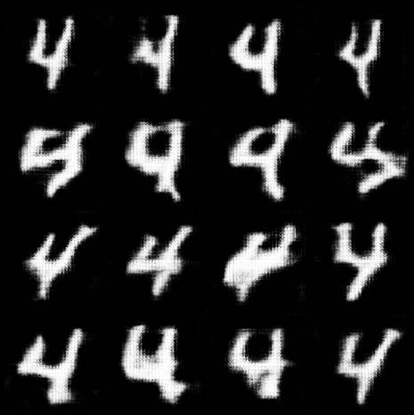
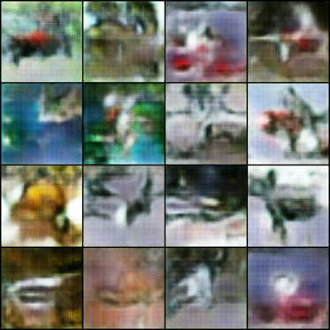

# 基于数据增强框架的数据预处理方案

安联医盟面向非独立同分布的医疗数据场景，尤其是极端的如特征缺失等情境下的联邦学习挑战，设计了一套基于数据增强框架的数据预处理方案。本方案从数据角度切入，在保证原数据安全性的前提下，对本地数据进行补充，有效缓解非独立同分布数据对联邦学习带来的影响，提升FATE框架对数据的包容度。

## 流程介绍

---

### 数据增强框架

**1.** **初始化：**

(1)  所有客户端（D）和中央服务器（S）准备就绪。

(2)  初始化虚拟样本共享比例  $\gamma$ 和 PSG 算法的辅助输入aux。

**2.** **客户端端数据增强：**

1. **初始化**：
   (1) 所有的客户端（D）和中央服务器（S）准备就绪。
   (2) 初始化虚拟样本共享比例 $\gamma$ 和 PSG 算法的辅助输入 aux。

2. **客户端数据增强**：
   对于每个客户端  $C_i$ :
   **(1)** 计算所需生成的虚拟样本数量  $m_{i}$，$m_{i} = \gamma * |D_{i}|$ ，其中 $|D_{i}|$ 表示客户端本地数据集的大小。
   **(2)** 从本地数据集 $D_i$ 的标签集合 $U_i$ 中使用 PLS（虚拟标签生成）算法，生成虚拟标签集合  ${y_{1}, y_{2}, ..., y_{m_{i}}}$ 。
   **(3)** 使用 PSG（虚拟样本生成）算法，通过生成对抗网络，生成虚拟样本特征  ${x_{1}, x_{2}, ..., x_{m_{i}}}$ 。
   **(4)** 将虚拟样本特征 ${x_{1}, x_{2}, ..., x_{m_{i}}}$ 和虚拟标签集合 ${y_{1}, y_{2}, ..., y_{m_{i}}}$ 合并为虚拟数据集 $\hat{D_{i}}$ 。

3. **上传虚拟数据到中央服务器**：
   客户端 $C_{i}$ 将生成的虚拟数据集 $\hat{D_{i}}$ 上传到中央服务器 S，以便其他客户端也可以访问这些虚拟数据。

4. **数据共享和分发**：
   **(1)** 中央服务器 S 等待，直到收到所有客户端上传的虚拟数据。
   **(2)** 中央服务器 S 将虚拟数据分发给其他客户端，确保每个客户端都能够访问其他客户端生成的虚拟数据。

5. **数据整合**：
   每个客户端 $D_{i}$ 接收其他客户端上传的虚拟数据，将这些虚拟数据与本地数据集合并，得到一个增强的本地数据集 $\hat{D_{i}}$ 。

6. **完成数据增强**：
   所有客户端完成虚拟数据的整合后，它们拥有了增强的本地数据集 $\hat{D_{1}}, \hat{D_{2}}, ..., \hat{D_{n}}$。

7. **输出**：
   DA-FL 框架输出增强的本地数据集，这些数据集可以用于联邦学习任务，以提高模型的性能和泛化能力。

### 虚拟数据生成算法

1. **初始化**：
   初始化判别器 $\mathcal{D}$ 和生成器 $\mathcal{G}$ 的参数 $\theta_{\mathcal{D}}$ 和 $\theta_{\mathcal{G}}$。

2. **训练主循环**：重复 T 次

   **(1)** 从标准正态分布中采样随机向量 $z_{1},…,z_{B}$ 

   **(2)** 从$\mathcal{D}$中随机采样 $(x_{1}, y_{1}),…, (x_{B}, y_{B})$

   **(3)** **训练判别器**：重复 B 次，训练判别器 $\mathcal{D}$ 以区分真实样本 $(x_{i}, y_{i})$ 和虚拟样本 $(\tilde{x}_{i}, y_{i})$ 
   	**①** 使用生成器 $\mathcal{G}$ 和随机向量 $z_{i}$ 生成虚拟样本 $(\tilde{x_{i}}, y_{i})$​。
   	**②** 计算判别器损失:

$$\ell_{\mathcal{i}}^{(\mathcal{D})}\leftarrow \log \mathcal{D}(\mathcal{x}_{\mathcal{i}},\mathcal{y}_{\mathcal{i}})+ \log (1 - \mathcal{D}( \tilde{x}_{i}, y_{i} ))$$
   
   ​	**③** 计算判别器梯度:用于后续更新判别器的参数。
   ​	**④** 梯度裁剪：
   
   $$\mathrm{g}_i^{(\mathcal{D}) } \leftarrow  \frac{\mathrm{g}_i}{\max(1,\left \| \mathrm{g}_i^{(\mathcal{D} )}  \right \|/c )}$$
   

4. **添加噪声**:  在梯度中添加随机噪声，以实现差分隐私

   $$\bar{\mathrm{g}}^{(\mathcal{D}) } \leftarrow \frac{1}{B} ( \sum_{i=1}^{B} \mathrm{g}_i^{(\mathcal{D})} + \mathcal{N}(0,\sigma ^2\mathcal{c}^2\mathbf{I} ))$$

6. **更新判别器参数**:

   $$\theta_{\mathcal{D}}\gets\theta_{\mathcal{D}}+\eta{\bar{g}^{(\mathcal{D})}}$$
   

8. **训练生成器**：重复 B 次，训练生成器$\mathcal{G}$ 以生成虚拟样本，目标是欺骗判别器

9. **更新生成器参数**

   $$\theta_{\mathcal{G}}\gets\theta_{\mathcal{G}}-\eta{\bar{g}^{(\mathcal{D})}}$$

11. **计算已消耗的隐私预算**：通过隐私损失计算函数 $\mathcal{A}$ 来计算已经消耗的隐私预算。

    $$\epsilon_{t} \leftarrow \mathcal{A}(\delta_{0},B,t,\sigma, |D| )$$
    

13.  **检查隐私预算是否超出限制**：如果已消耗的隐私预算 $\epsilon_{t}$ 超过了初始隐私预算 $\epsilon_{0}$，则停止训练。

14. **生成虚拟样本**：

   **(1)** 正态分布随机采样$z$

   **(2)** 	$\widetilde{x_k}\gets\mathcal{G}(z,y_k)$

11. **返回生成的虚拟样本特征** $ \hat{x_{1}}, ... ,\hat{x_{m}} $ 

### 虚拟标签生成算法

1. 计算每个客户端需要生成的虚拟样本数量:
   
   $$\hat{n}\gets\left\lfloor\gamma n\right\rfloor$$

3. 对于每个类别 $k$ ：

​	**(1)** 对于每个客户端 $r$ ：
​         **①** 依据下式计算取值概率：

$$Pr[\hat{n}_k = r] = \frac{exp(\frac{\varepsilon u_k(D,r)}{2 \Delta u_k}) }{\sum_{r^{'}\in [\hat{n}]}^{}exp(\frac{\varepsilon u_k(D,r^{'})}{2 \Delta u_k})  }$$

​	**(2)** 根据①的概率输出$\hat{n}_k$。

3. 转化虚拟标签：将 $\hat{n}_1,...,\hat{n}_L$ 转化为 $\hat{y}_1,...,\hat{y}_m$ 。
4. 返回虚拟标签：$\hat{y}_1,...,\hat{y}_m$。

## 理论分析

---

### 隐私性保障

- 虚拟标签生成过程满足 $(\varepsilon_1,0)$ -差分隐私。
- 虚拟样本生成过程，在 GAN 训练过程中，对判别器的每个梯度进行剪裁以控制其敏感度，然后将同一批次的梯度进行平均并添加噪声，以抵御差分攻击。该算法满足 $(\varepsilon_0,\delta_0)$ -差分隐私。
- 整个数据增强框架满足$(\varepsilon,\delta)$-差分隐私，其中 $\varepsilon=\varepsilon_0+\varepsilon_1$ ，$\delta=\delta_0$ 。

### 效率保障

- 本方案所有过程均在数据预处理阶段进行，不会影响联邦学习过程的通讯效率。
- 本方案所共享的虚拟数据为一定比例的原始数据，通过调整共享比例，可缓解数据预处理的通讯开销。

## 性能展示

---

### 常用数据集生成效果

